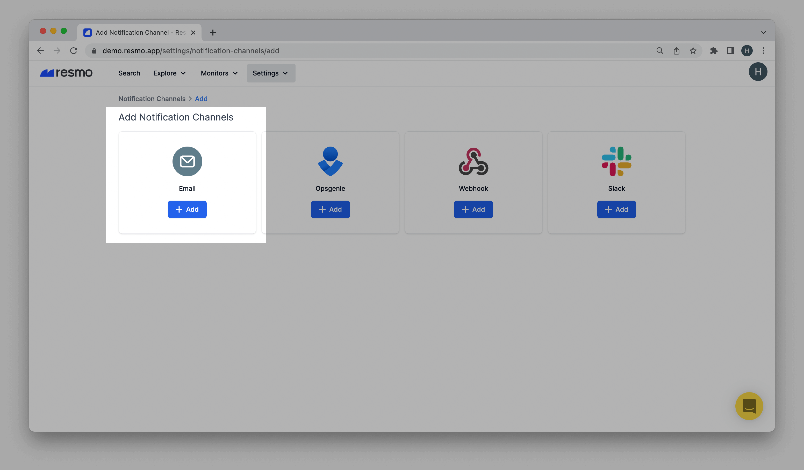
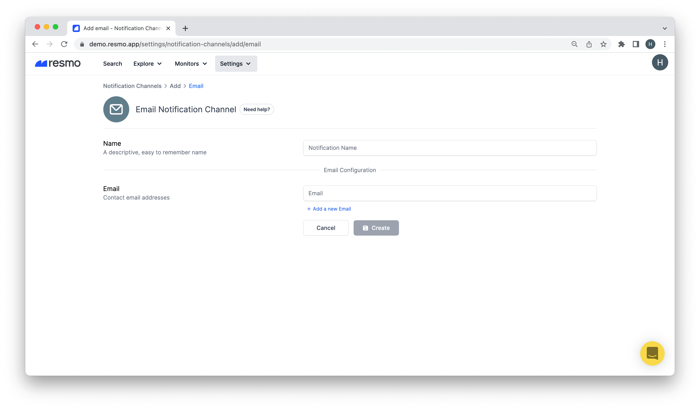

# Email Notification Channel

### How do email notifications work?

Once you set up an email notification channel, Resmo sends automated notification/alert emails only when there is a violation against the notification rules you connected to the channel. Users can set up separate email notification channels for different notification rules.

* Notifications are sent in near real-time.
* Multiple emails can be added to an email notification channel.
* To connect a notification rule to a notification channel, you must select the channel on the individual notification rule page.

### How to add an email notification channel

1. Log into your Resmo account.
2. Click Settings from the navigation bar and then, Notification Channels.

.png>)

3\. Click the Add Notification Channels button from the top right corner.

4\. Select Email as your channel to receive Resmo notifications.

5\. Give a descriptive name to your notification.

6\. Enter a contact email address (Single or multiple) to receive notifications.&#x20;

7\. Click the Create button.

**Note:** To manage created notification channels, navigate back to Notification Channels.

### How to delete a notification channel

1. Sign in to your Resmo account.
2. Click Settings from the navigation bar and then Notification Channels.
3. Click the notification channel you wish to delete.
4. Delete the channel by clicking the Delete button from the top right corner.
