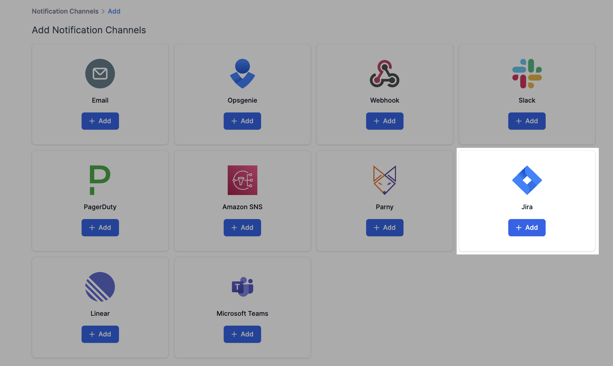
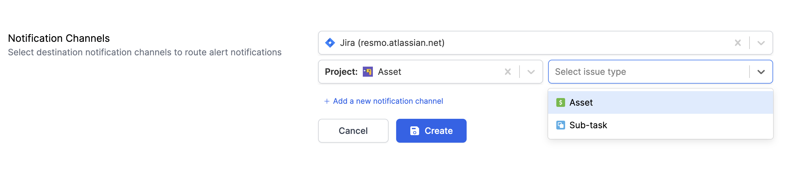
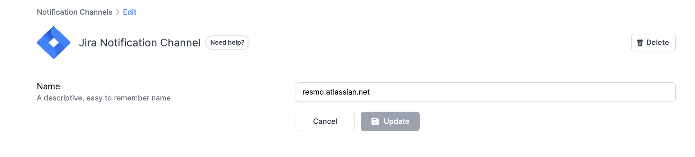

# Jira Notification Channel

### How do Jira notification channels work?

When setting up a Jira notification channel, Resmo asks you to specify a project on Jira and an issue type, such as a task, epic, subtask, or bug. Depending on your selection, Resmo sends your alerts to Jira as new issues.

### How to set up a Jira notification channel

1. Go to Settings and click on Notification Channels.
2. Add Jira.

<figure><figcaption></figcaption></figure>

3. Select a project and an issue type.

<figure><figcaption></figcaption></figure>

3. Hit the Create button.
4. Accept permissions from the opening window.
5. Your Jira notification is ready. You can select it when you're creating an alert.

### How to delete a Jira notification channel

2. Navigate to Settings > Notification Channels.
3. Select the Jira notification channel you want to remove.
4. Click the Delete button from the top right corner.

<figure><figcaption></figcaption></figure>
