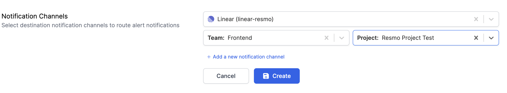
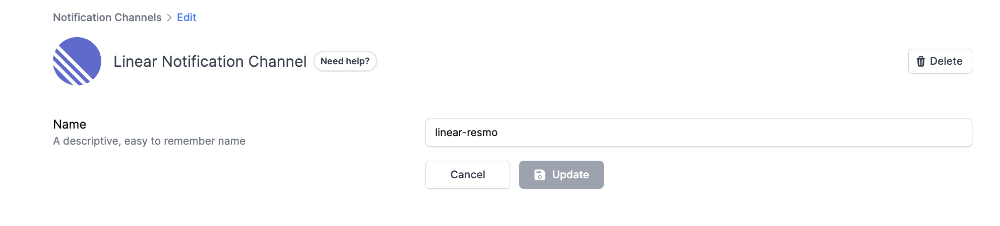

# Linear Notification Channel

### How do Linear notification channels work?

By configuring a Linear notification channel, Resmo asks you to specify a Linear team and a project. Once you have set up the Linear channel and chosen it for alerts, Resmo will automatically create issues on your Linear account based on the team and project you have specified. This ensures you are promptly notified of any rule violations in real-time.

### How to set up a Linear notification channel

1. Go to Settings and click on Notification Channels.
2. Add Linear.

<figure><figcaption></figcaption></figure>

3. Select a team and a project.

<figure><figcaption></figcaption></figure>

4. Hit the Create button.
5. Accept permissions from the opening window.
6. Your Linear notification is all set! You can select it when you're creating an alert.

### How to delete a Linear notification channel

2. Navigate to Settings > Notification Channels.
3. Select the Linear notification channel you want to delete.
4. Click the Delete button from the top right corner.

<figure><figcaption></figcaption></figure>
