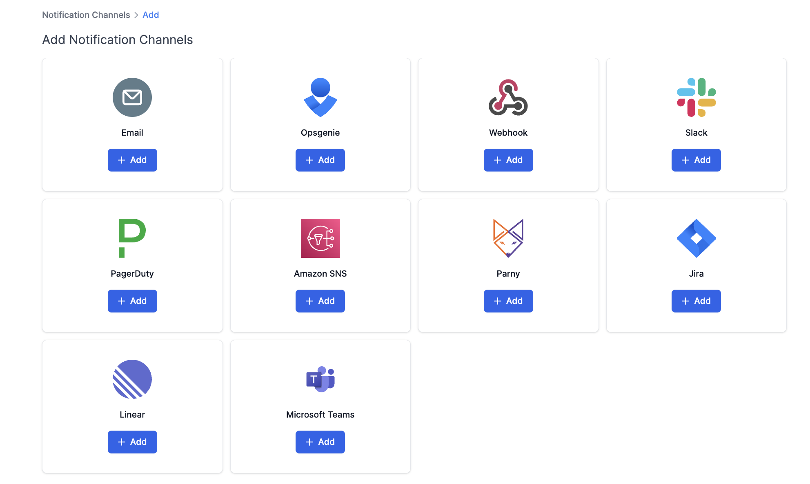
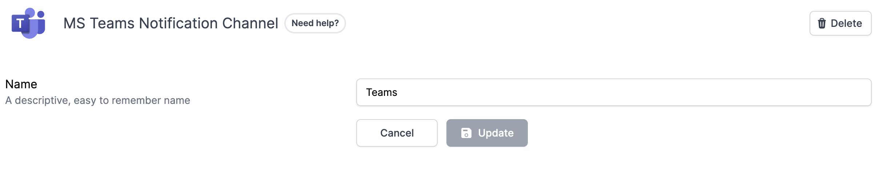

# Microsoft Teams Notification Channel

### How do Microsoft Teams notification channels work?

Once you set up a Microsoft Teams notification channel, you will be able to select it as your preferred channel for your alerts. After you have set up the MS Teams channel and chosen it for notifications, Resmo will send alerts to your connected app. This way, you will be notified of any rule violations near real-time.

### How to set up a Microsoft Teams notification channel

1. Go to Settings > Notification Channels.
2. Click on the Add Notification Channel button.
3. Add Microsoft Teams and hit the Create button.

<figure><figcaption></figcaption></figure>

4. Accept permissions.
5. You have now created your notification channel and will be able to select it when you're configuring an alert.

### How to delete a Microsoft Teams notification channel

1. Go to Settings > Notification Channels.
2. Select Microsoft Teams and click the Delete button from the top right.

<figure><figcaption></figcaption></figure>
