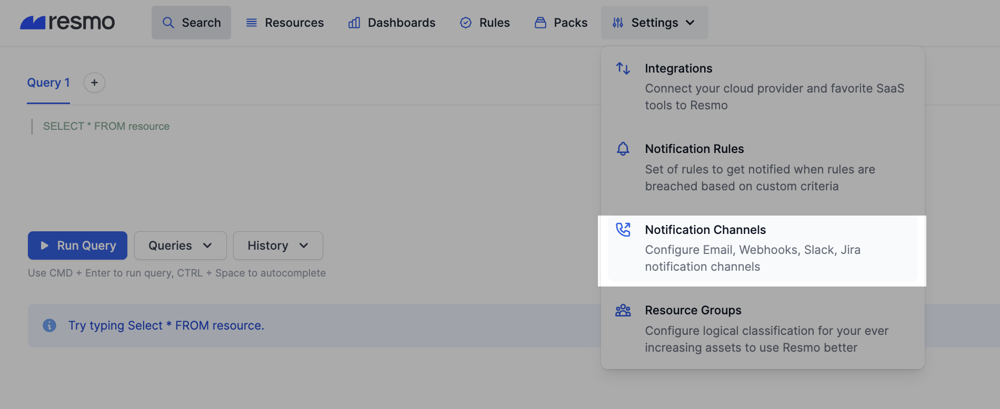

# Notification Channels

Resmo offers many notification options to send timely updates for certain actions. Users can add new channels under "Notifications Channels"  and reuse them for different actions. For now, notifications are mainly used for getting alerts on rule violations.

We offer the following notification channels.

* [email-notification-channel.md](email-notification-channel.md "mention")
* [slack-notification-channel.md](slack-notification-channel.md "mention")
* [webhook-notification-channel.md](webhook-notification-channel.md "mention")
* [opsgenie-notification-channel.md](opsgenie-notification-channel.md "mention")
* [amazon-sns-notification-channel.md](amazon-sns-notification-channel.md "mention")

Add a notification channel:

