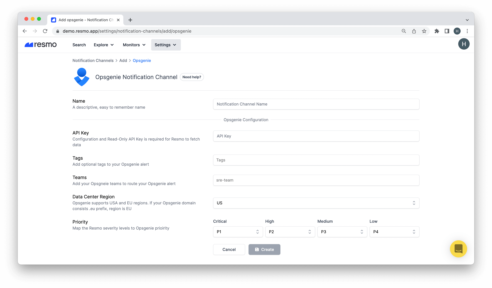

# Opsgenie Notification Channel

### How do Opsgenie notification channels work?

Resmo fetches data using a Configuration and Read-Only API Key from your Opsgenie account. In order to match Opsgenie alert priorities with Resmo severity levels, you must map them on the setup process. Once the setup is complete, you will start receiving near real-time Opsgenie alerts when Resmo detects a rule breach.&#x20;

* To connect a notification rule to a notification channel, you must select the channel on the individual notification rule page.

### How to set up an Opsgenie notification channel

1. Login to your Resmo account.
2. Click Settings, then Notification Channels.
3. Click the Add Notification Channels button and select Opsgenie.
4. Give a descriptive name to the channel.

5\. Copy the Configuration and Read-only API Key from your Opsgenie account.

6\. Paste it to the API Key field on the notification channel setup page.

7\. Optionally, add Tags and Teams to your Opsgenie alert.

8\. Select your Data Center Region. Opsgenie supports USA and EU regions. If your Opsgenie domain consists _.eu_ prefix, the region is EU.

9\. Next, map Resmo severity levels to Opsgenie priority.&#x20;

10\. Click Create.

**Note:** You can manage created notification channels from the Notification Channels panel.

### How to delete an Opsgenie notification channel

1. Navigate to Settings>Notification Channels.
2. Click the notification channel you wish to delete.
3. Delete using the top-right Delete button.
