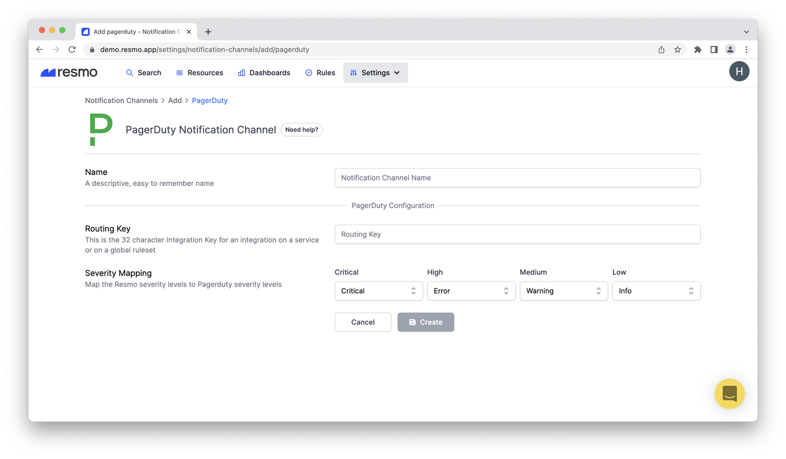

# PagerDuty Notification Channel

### How do PagerDuty notification channels work?

Once you set up a PagerDuty notification channel and map your Resmo severity levels with PagerDuty severity levels, you will be notified via PagerDuty whenever a rule you have set up is violated, based on your notification rules settings.

### How to set up a PagerDuty notification channel

1. Log in to your Resmo account.
2. Navigate to Settings>Notification Channels.
3. Click the Add Notification Channels button from the top right.
4. Add PagerDuty on the following screen.
5. Give a descriptive name to the integration.

6\. Enter the Routing Key in the related field. (A Routing Key is the 32-character Integration Key for integration on a service or on a global ruleset.)

7\. Map your Resmo severity levels with PagerDuty severity levels. (You can read more about PagerDuty [Severity and Urgency Mapping](https://support.pagerduty.com/docs/dynamic-notifications#severity-and-urgency-mapping).)

8\. Click Create, and it's all set up.

**Note:** You can manage created notification channels from the Notification Channels panel.

### How to delete a PagerDuty notification channel

1. Go to Settings>Notification Channels.
2. Select the PagerDuty channel you wish to delete.
3. Click Delete.
