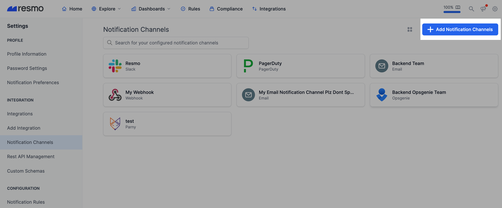
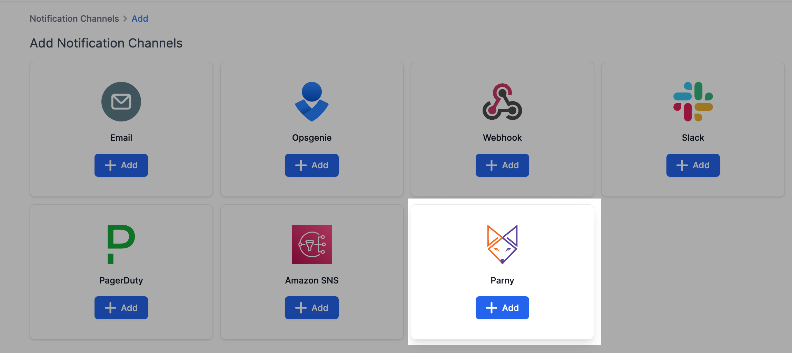
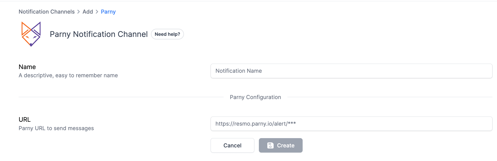
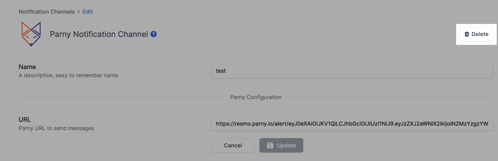

# Parny Notification Channel

### How do Parny notification channels work?

Once you set up a Parny notification channel, you will be able to receive alert notifications from Resmo on your connected app. This way, you will be notified of any rule violations near real-time.

* To connect a notification rule to a notification channel, you must select the channel on the individual notification rule page.

### How to set up a Parny notification channel

1. Go to your Settings page on Resmo by clicking the gear icon from the top right corner.

<figure><figcaption></figcaption></figure>

2. Then, navigate to Notification Channels from the left sidebar.
3. Click the Add Notification Channels button.

<figure><figcaption></figcaption></figure>

4. Add Parny.

<figure><figcaption></figcaption></figure>

5. Name the notification channel to remember it later.

<figure><figcaption></figcaption></figure>

6. Enter the URL (HTTPS endpoints to send data).
7. Click Create.

**Note:** You can manage created notification channels from the Notification Channels panel.

### How to delete a Parny notification channel

1. Go to your Notification Channels page and click the Parny notification channel you want to remove.
2. Click the Delete button from the top right.

<figure><figcaption></figcaption></figure>
