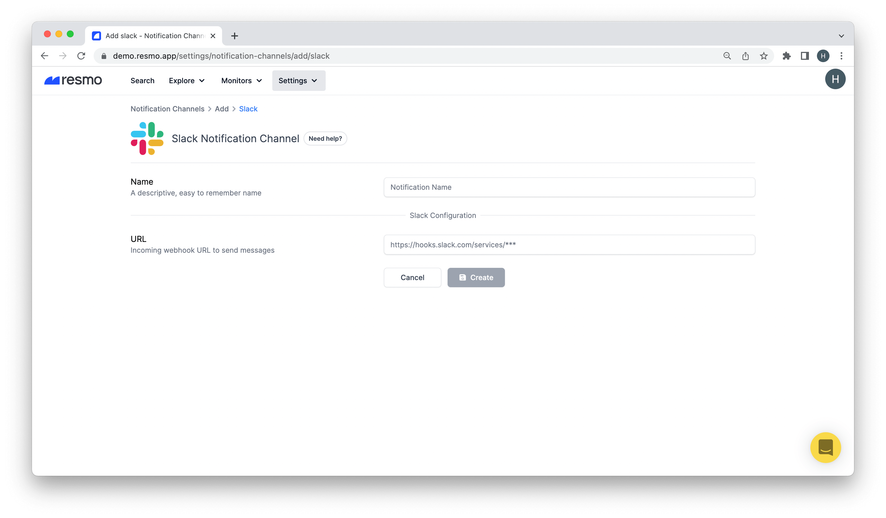

# Slack Notification Channel

### How do Slack notifications work?

Once you set up a Slack notification channel and add it to a notification rule, you will be notified of rule changes with their severity in near real-time.&#x20;

* To connect a notification rule to a notification channel, you must select the channel on the individual notification rule page.

### How to set up a Slack notification channel

1. Sign in to your Resmo account.
2. Go to Notification Channels from the Settings tab.
3. Click on the Add Notification Channels button.
4. Select Slack as your channel.

5\. Give a descriptive name to it (e.g., the integration you will use it for.)

6\. Enter an incoming webhook URL and click Create.&#x20;

**Note:** You can manage created notification channels from the Notification Channels panel.

### How to delete a Slack notification channel

1. Login to your Resmo account.
2. Navigate to Notification Channels from the Settings tab.
3. Click the channel and delete it by clicking the Delete button on the top right.
