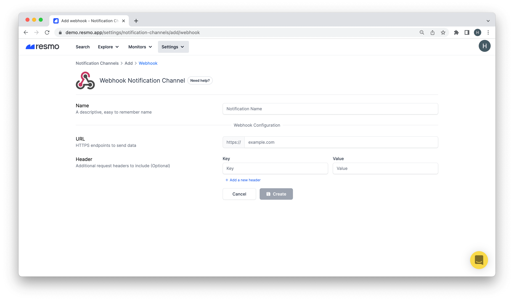

# Webhook Notification Channel

### How do webhook notification channels work?

Once you set up a webhook notification channel, you will be able to receive alert notifications from Resmo on your connected app. This way, you will be notified when there are any rule violations n near real-time.

* To connect a notification rule to a notification channel, you must select the channel on the individual notification rule page.

### How to set up a webhook notification channel

1. Login to your Resmo account.
2. Navigate to Notification Channels from the Settings tab.
3. Click Add New Notification Channels and select Webhook.

4\. Name the notification channel to remember it later.

5\. Enter the URL (HTTPS endpoints to send data).

6\. Optional: enter additional request headers to include.

7\. Click Create.

**Note:** You can manage created notification channels from the Notification Channels panel.

### How to delete a webhook notification channel

1. Go to the Notification Channels page.
2. Click the channel you wish to delete.
3. Delete using the top-right Delete button.
