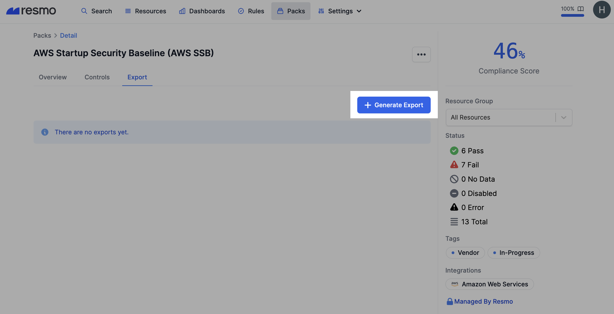
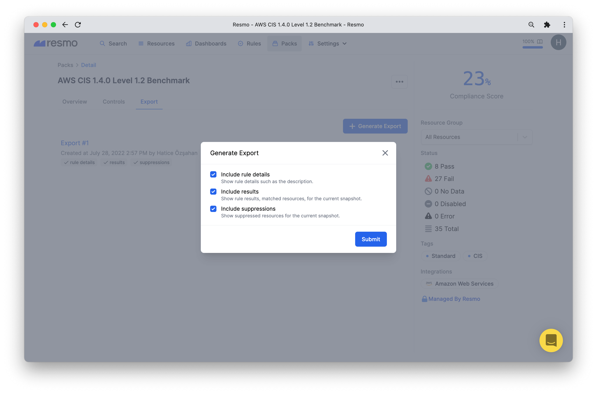
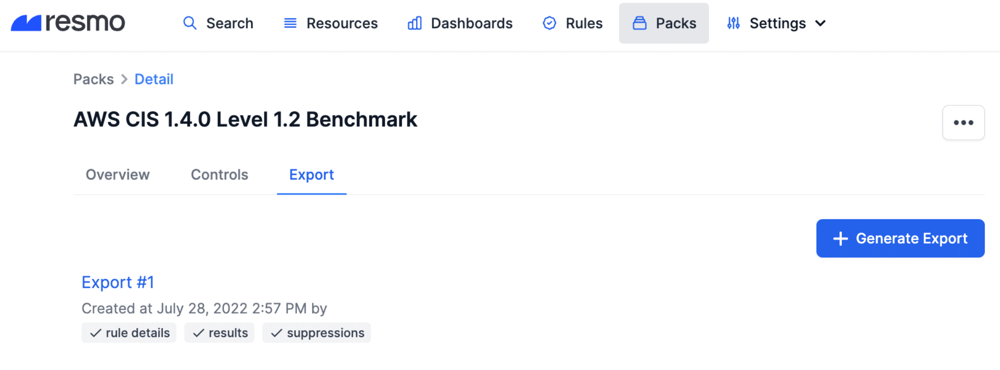
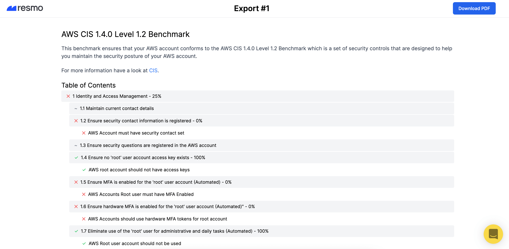

# Pack Exports

Packs can be exported, containing;

* Rule details such as description
* Results: rule results and matched resources for the current snapshot
* Suppressions: suppressed resources for the current snapshot

Exports can be downloaded as PDFs.

### How do pack exports work?

* Only one export can be generated for a pack and resource group simultaneously. I.e., you can generate exports for the MFA pack, both for production and staging resources at the same time.&#x20;
* If there’s an export in progress within the production resource group, you must wait for the prior one to complete before generating another.&#x20;
* To add suppressions into an export, you must include Rules in your export request.&#x20;
* The standard pricing plan covers 5 exports per day for each pack and resource group; the professional and partner plans cover 10.&#x20;
* Resmo sends an email containing the export link to the user who started the export.
* All exports for a pack or resource group are listed in the Export tab on your Pack Detail page.
* Export results are opened in the browser and can be downloaded as PDFs.

### How to generate a pack export

1. Log in to your Resmo account and navigate to the Packs page.
2. Open the detail page of a pack you wish to export.
3. Go to the Export tab and click the **Generate Export** button.

4\. Select what to include in your export and **submit**.

5\. Once the export is generated, it will be **listed on the Export tab**. Click to open it in the browser.

6\. To **download it as a PDF**, hit the Download PDF button from the top right.

### Troubleshooting

If you have further questions or issues with pack exports, reach out to our team via live chat or email us at contact@resmo.com.
