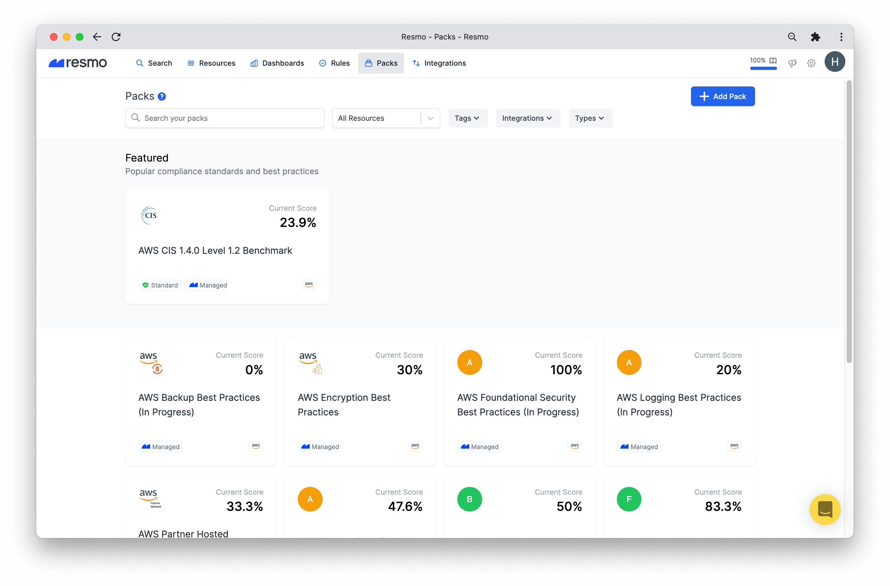
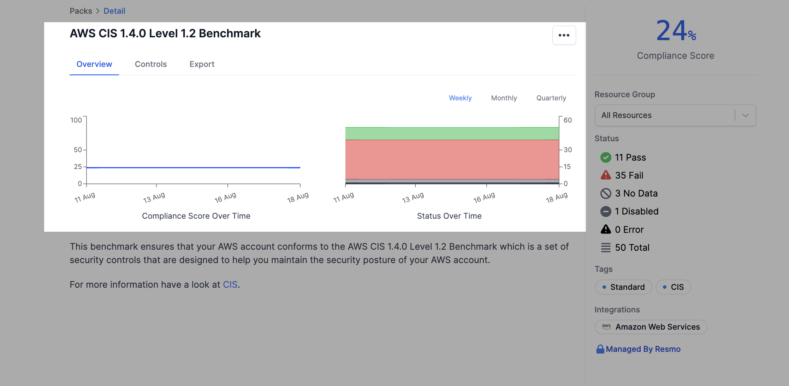
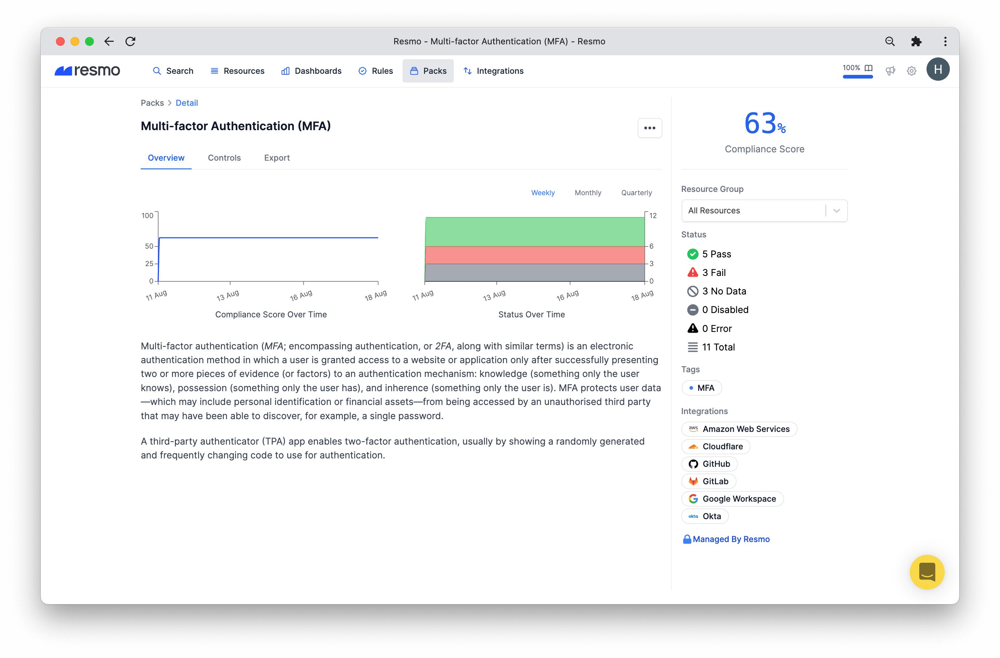
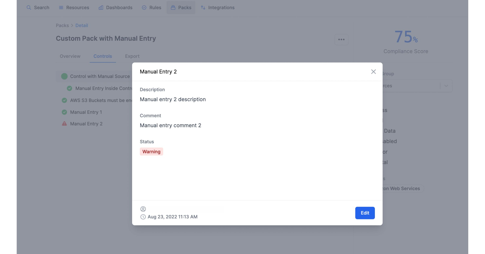
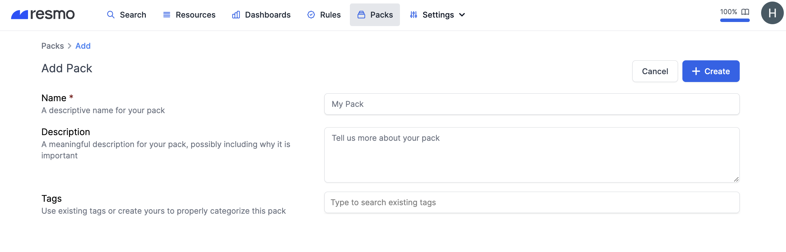
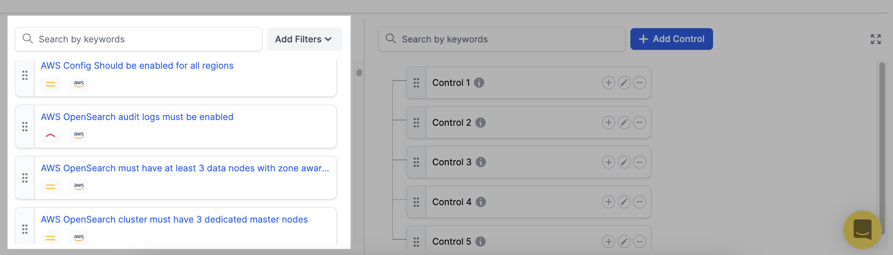
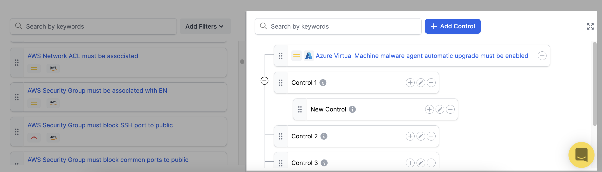

# Packs

A pack is a collection of controls and rules that allow you to continuously track your asset security and compliance while providing score and export functionality.&#x20;

### How do packs work?

* They can be exported as PDFs containing rule details, results, and suppressions.
* You can see the compliance score of your packs.
* Packs are compatible with resource groups, allowing you to see individual scores for each resource group.
* Professional and Enterprise users can create custom packs for custom needs.

### What do packs offer for Resmo users?

* Continuous and accelerated checks for security and compliance best practices
* Exportable results
* Compliance scores for a faster overview
* Ability to create custom packs with a specified selection of rules
* Ability to see each control's status (how many pass or fail etc.)

### Pack Types

* **Standard packs** show your compliance against industry standards like CIS. This is managed by Resmo.
* **Other Managed packs** automatically check against best practices. This is managed by Resmo.
* **Custom packs** allow you to create your packs for your custom compliance requirements.

### Pack details

#### Charts

Charts on each pack's Overview display compliance scores and status changes over weekly, monthly, and quarterly periods.

#### Overview

The overview tab on the pack detail page aims to cover a short guideline about the individual pack, including compliance score and status over time charts.

#### Controls

Control results are listed in the Controls tab on Pack Detail pages. Click on a control to expand or collapse it. Current statuses can be seen next to each.

#### Export

You can generate an export for each pack from the Export tab and see all-time exports. [See more details](pack-exports.md).

#### Manual comment entry

<figure><figcaption></figcaption></figure>

Rules are a method of analyzing your assets and are managed by Resmo. However, in some cases, rules may not be applicable to automate the whole process. Some controls require manual completion. For these kinds of controls, you can use the manual control type. Resmo provides manual control definitions in managed packs, allowing you to mark it as applicable or not depending on your system.&#x20;

Additionally, you can enter comments to manual controls, i.e., to add links, write reasons for being applicable or inapplicable, provide evidence, etc.

### How to create a custom pack

1. Log in to your Resmo account and go to the Packs page from the navbar.
2. Name your pack. Optionally, you can add a description and tags.

3\. Drag and drop the **rules** on the left (that you wish to add as controls) to the **Controls section** on the right.

* You'll see a list of rules on the bottom left. You can use the search box or filters to find specific rules.

* The control list is on the bottom right. Drag and drop rules from the left to the Controls.&#x20;
* You can rearrange the order, add sub-controls, and/or delete a control.
* Just drag and drop a control to change its order.&#x20;
  * Plus button>add a new control.
  * Edit button
  * Minus button>remove a control.
* Use the search box to spot controls faster.

4\. Once your controls are in place, hit the Create button from the top right of the page.

### Support

For further questions regarding Packs, contact us via live chat or email us at contact@resmo.com.
