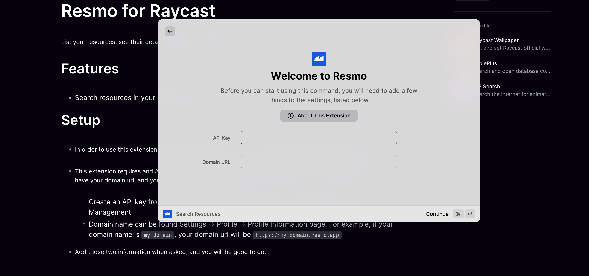
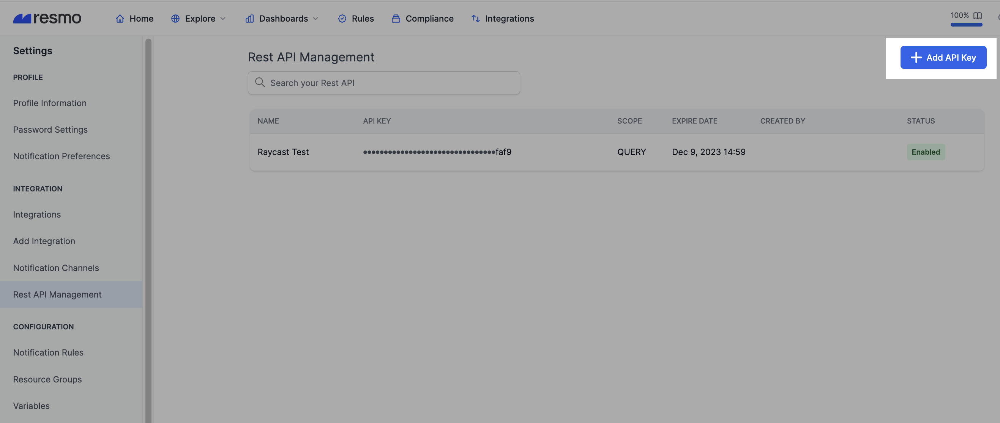
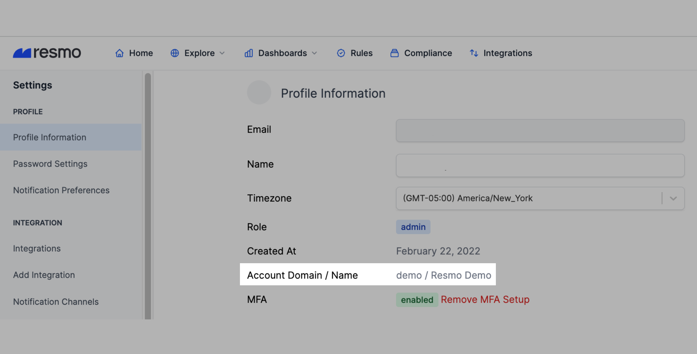

# Raycast

<figure><figcaption></figcaption></figure>

### What does Resmo offer to Raycast users?

* Open your launcher and quickly search resources from cloud services and SaaS applications that you integrated your Resmo account with.
* List resources, see their details, and easily navigate to your Resmo interface from there.

### How does the extension work?

In order to use the extension, you need a Resmo account. You can create your account for free from [here](https://id.resmo.app/). This extension requires a Resmo API Key and Domain URL in order to run. Once you create your Resmo account, you will have your domain URL, and you can create an API Key. After you complete the installation process, you can immediately start searching for your resources.

## Installation walkthrough

### How to install the Resmo extension

In order to complete the installation, you must have a Resmo account and Raycast installed on your desktop.&#x20;

1. Go to the Raycast store page and search Resmo.&#x20;
2. Click the Install Extension button and it will open the Raycast application on your desktop.

<figure><figcaption></figcaption></figure>

3\. The integration requires an API key and a Domain URL.&#x20;

<figure><figcaption></figcaption></figure>

4\. Go to your Resmo account and create an API key from the Rest API management page. **Settings -> Integration -> Rest API Management -> Add API Key**

<figure><figcaption></figcaption></figure>

5\. Your Resmo domain name can be found under **Settings -> Profile -> Profile Information** page. For example, if your domain name is `my-domain`, your domain URL will be `https://my-domain.resmo.app`

<figure><figcaption></figcaption></figure>

* Copy your Resmo API key and domain URL and paste them into related fields on the extension installation page.&#x20;

4\. That's it! Now you can quickly click Option + Space and search resources across your cloud and SaaS.

### Support

If you run into any issues with your Resmo - Raycast extension or if you have any related questions, contact our team via live chat or email us at contact@resmo.com. We'll get in touch in no time!
