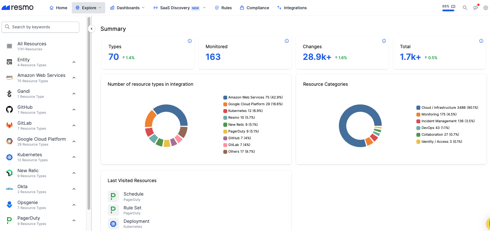

# Manual Tagging

Resmo provides a simple and efficient way to manually tag resources, making it easy for you to add, edit, and delete tags right inside resource detail modals. This way, you can better categorize and filter your resources as needed.

### How to tag resources manually

1. **Navigate to the Resources page:** To begin, log in to your Resmo account and navigate to the Explore section. From there, click on the "Resources" option to access your resources.

<figure><figcaption></figcaption></figure>

2. **Select a resource to tag:** Browse through your resources to find the one you'd like to tag. Click on the resource to view its details.

<figure><figcaption></figcaption></figure>

3. **Click the +Add Tag option:** On the resource details page, locate the "+Add Tag" text on the right side of the screen. It allows you to select and add tags to your chosen resource.
4. **Add tags to your resource:** Click the "+Add Tag" text, and a list of available tags will appear. You can either choose from the existing tags or create a new tag by typing in the desired name and hitting "Enter" on your keyboard.

Select the tags you want to add to your resource by clicking on them.


Once you create a tag within any resource, it will automatically be added to the tags filter on your Resources page and be displayed in the dropdown menu. When selected, the results will be filtered down to resources with the selected tag.



If you create a new tag within a specific resource detail modal, you can also use the same tag for other resources as well by selecting it under Add Tag on those resources' detail modals.


5. **Confirm your selection:** Once you have selected all the tags you want to apply to the resource, click anywhere outside the tag list to close the selection window. The tags you've chosen will now appear on the resource details page, confirming that they have been successfully added.

And that's it! You have now manually tagged a resource in Resmo. With the tags in place, you can easily filter and categorize your resources as needed. Remember that manual tagging is available for both Professional and Enterprise plans, allowing you to maintain a well-organized and easily searchable resource library.

Still have questions? Contact us via live chat or email us at contact@resmo.com.
