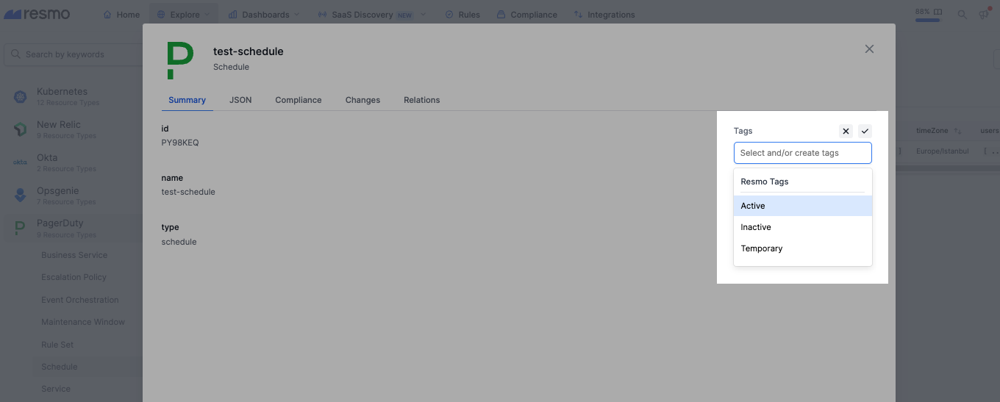
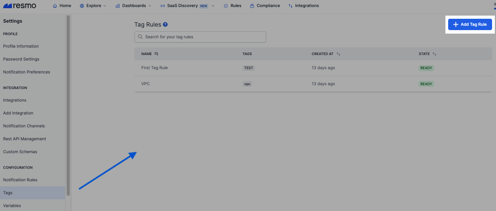
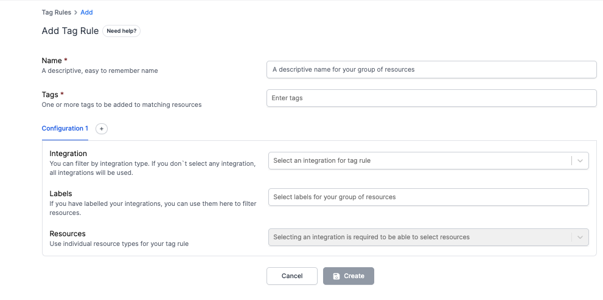
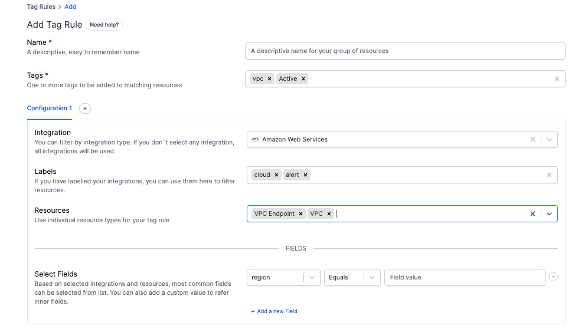

# Tag Rules

With the automatic tagging feature, you can create "**tag rules**" to tag your resources automatically based on specified criteria. This eliminates the need for manual work and simplifies filtering and categorizing resources.


Resource Groups are no longer needed and have been removed.


Resmo offers two different types of resource tagging:

[**Manual Tagging**](manual-tagging.md): To manually tag a resource, navigate to Explore > Resources, click on a resource to view its details, and then click +Add Tag on the right side to select and add tags to the resource.

<figure><figcaption></figcaption></figure>

### **Auto-Tagging**

Auto-tagging allows you to create Tag Rules that automatically filter resources matching the configurations you set and then apply the appropriate tags to those resources.

### Configuring a Tag Rule

1. Navigate to the Settings page and click on **Tags** under Configurations in the left sidebar. Click the **Add Tag Rule** button to start configuring a new rule.

<figure><figcaption></figcaption></figure>

2. Name your Tag Rule.

<figure><figcaption></figcaption></figure>

3. Enter one or more tags that will be applied to matching resources.

<figure><figcaption></figcaption></figure>

4. Fill out the configuration settings. You can add multiple configurations for a single Tag Rule. Options include:

* Selecting an integration. If you don't select any, all integrations will be used.
* Using labeled integrations to filter resources.
* Selecting individual resource types for your tag rule.

5. Choose from the most common fields based on the selected integrations and resources, or add a custom value to refer to inner fields. You can add multiple fields to a single Tag Rule.
6. Click the **Create** button, and your Tag Rule is now active!

If you have any questions or need assistance, please feel free to contact us via live chat or email us at contact@resmo.com.
