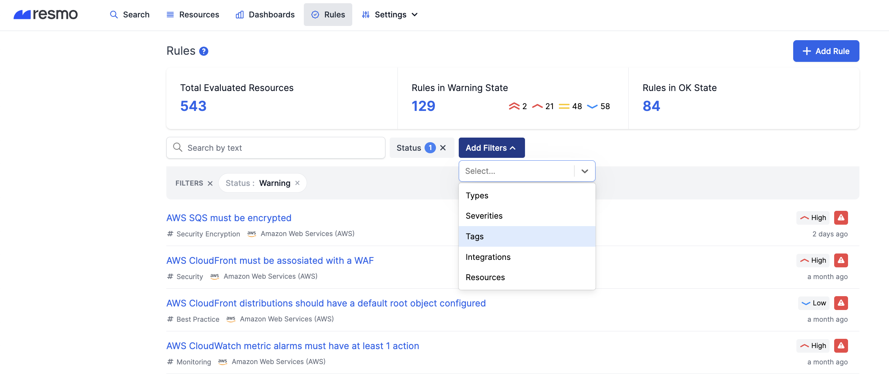
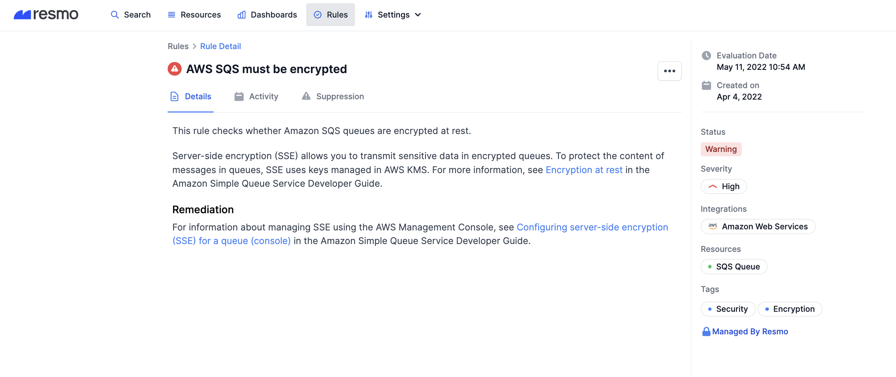
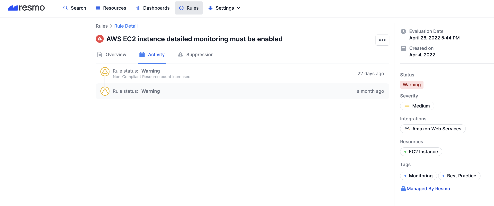
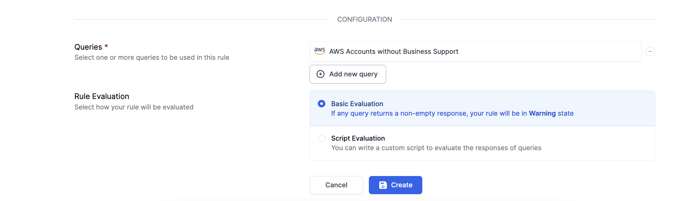
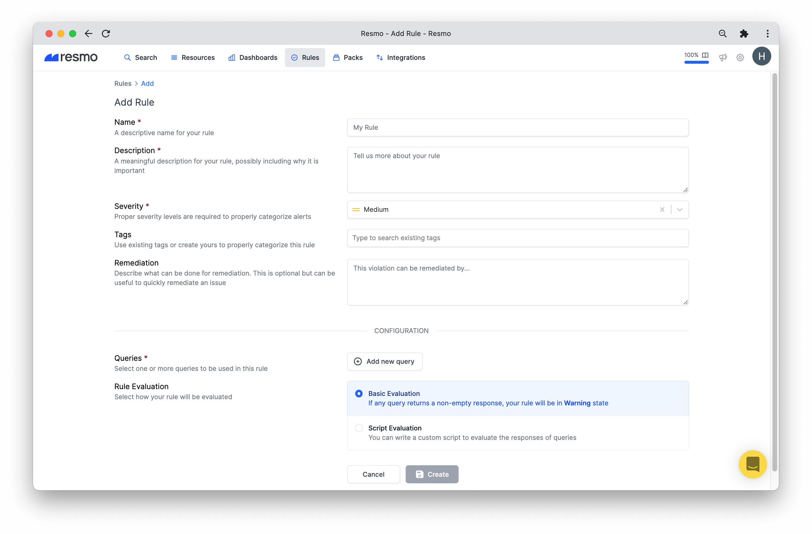

# Rules

Rules are how you evaluate resource validity to check if they comply with best practices.

There are two types of rules; managed and custom rules.

### Common Rule Fields

#### Name

Rule names make it easy for you to recognize a rule at a glance. Managed rules have predefined names while custom rule names are defined by the rule creator.

#### Rule filters

Rule filters are there to let you find what you are looking for as fast as possible. You can filter your rules based on:

* Status
* Types
* Severities
* Tags
* Integrations
* Resources

### Rule Evaluation

Once you set up a rule, it checks your resources at regular intervals to validate their best practice conformance. Rule evaluation activities with details and dates can be observed on each rule's individual page.&#x20;

### Rule Activity

Rule Activity is one of the tabs on your Rule Detail pages. It is where you can find the information on an individual rule's status, change date, activities such as suppression, and the actor. Tracking rule activities prove useful in accelerating incident response times and remediation.

Any change event in a rule triggers an update on the Activity tab in near real-time. You can also see the last evaluation date at the top right corner of your Rule Detail page.

* Rule status
* Suppression
* Date of change
* Actor
* Activity

### Managed Rules

Resmo provides managed rules for common best practices. Our team maintains them, so you don't have to know every critical security and compliance vulnerability.&#x20;

### Custom Rules

Custom rules allow you to create rules that don't exist among managed ones. You can use your saved custom queries or managed queries for your rules.

#### How to Create a Custom Rule

1. Login to your Resmo account and navigate to the Rules page.
2. Click on the Add Rule button from the top right.

3\. Give a descriptive name to your rule and select its severity.

4\. Optionally, you may add tags and a remediation description in case of rule violation.

5\. Click the Add new query button to add one or more queries for your rule.

6\. Next, select how your rule will be evaluated.

* **Basic evaluation:** If any query returns a non-empty response, your rule will be in a Warning state.
* **Script evaluation:** You can write a custom script to evaluate the responses of queries.

7\. Next, you will need to add a query or queries that will trigger the rule.

8\. There is an optional Evaluation Script field. If your rule requires custom evaluation logic, you can write it as an expression to satisfy your needs.

9\. Hit the Create button, and now you have a custom rule!

### Support

If you still have questions or issues regarding Rules, feel free to contact us via live chat or email us at contact@resmo.com.
