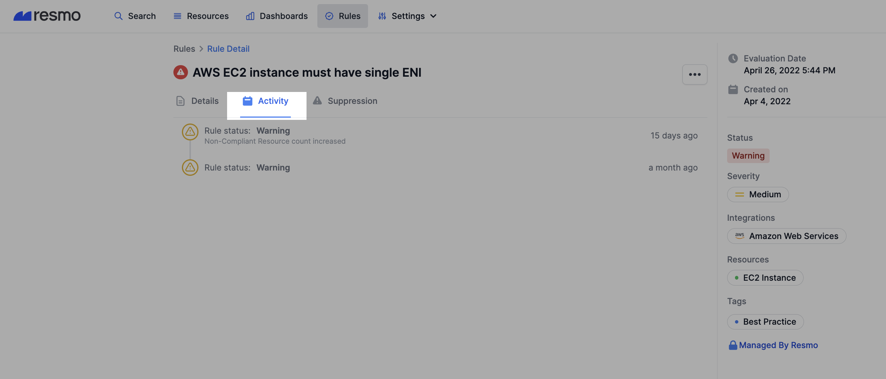
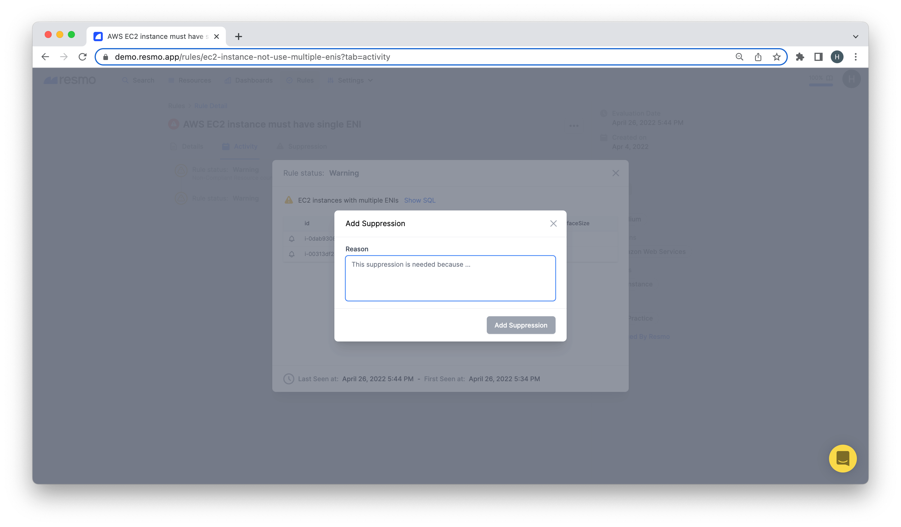
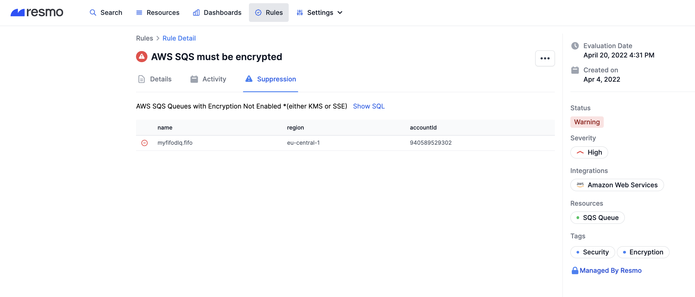
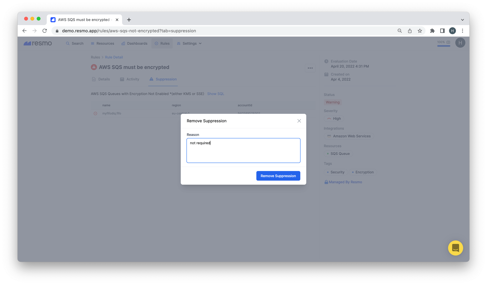

# Suppression

Suppression helps you mark particular resources inside a rule to signal Resmo to ignore them. For example, if you have an S3 bucket or another resource you left intentionally public, you might suppress it inside a rule. This way, you will only see the resources that are not intentionally against your Resmo rule and needs closer investigation.

**Note:** If you add a reason to your suppression or suppression removal, your suppression will be visible in the rule activity by others.

### How to add a suppression

1. Log in to your Resmo account.
2. Navigate to the Rules page and select the rule you wish to suppress a resource from.

3\. On the Activity tab, click on the Rule Status and a modal window will open.

.png>)

4\. To suppress a resource in that list, just hit the bell icon on its left side.

5\. Another modal will ask you the reason for your suppression.&#x20;

6\. Click the Add Suppression button and it's all done!

### How to remove a suppression

1. Open the Rule details where the suppression exists.

.png>)

2\. Click the Suppression tab on the Rule Detail page.

3\. Now, click the remove icon (-) next to the suppression you wish to delete.

4\. Type in the reason for your suppression removal and click Remove Suppression.

### Support

If you have any questions about suppression, contact us via live chat on our website or email us at contact@resmo.com.
