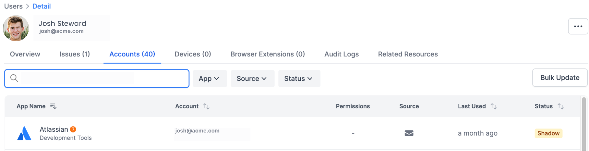

# AI Email Scanning

Resmo Email Scanning checks your emails to find where you might have signed up for new accounts. It looks for emails that are about joining or subscribing to something. This way, you can easily see what accounts you've made through emails and manage them with Resmo.

### How the Scan Process Works&#x20;


Currently, email scanning supports Google Workspace only.


The first step in the process is downloading Gmail emails for all users in your organization. To achieve this step successfully you will need to create a service account and configure domain-wide delegation for this account.

### How to Create a Service Account


* Credentials and super admin rights are required in Google Workspace is provided by service account. To configure service account, you can check documentation from here. Steps:
* Credentials and super admin rights are required in Google Workspace is provided by service account.
* To configure service account, you can check documentation from [here](https://cloud.google.com/iam/docs/service-accounts-create).


1. Open the Google Cloud Console ([https://console.developers.google.com](https://www.ibm.com/links?url=https%3A%2F%2Fconsole.developers.google.com)).
2. Select a project. If there are no existing projects, create a project.
3. Enable the API.

* On the navigation menu, select **API & Services** > **Library** option if it is not already selected.
* In the displayed list of APIs, click **Admin SDK API** and **Gmail API** . Enable these options if they are not already enabled.

<figure><figcaption></figcaption></figure>

4. On the navigation menu, select **Credentials**.
5. To create a new service account click **Create Credentials**.
   * From the drop-down menu, select **Service Account**.
   * Enter the account name.\
     The ID is automatically populated.
   * To furnish a new private key, select the json key type.
   * Click **Create**.\
     You are prompted to download the key.

<figure><figcaption></figcaption></figure>

<figure><figcaption></figcaption></figure>

### How to Add Domain-Wide Delegation&#x20;


* Domain-wide delegation provides credentials are required to read all emails.
* To configure domain-wide delegation, you can check documentation from [here](https://support.google.com/a/answer/162106?hl=en#zippy=).


1. [Sign in](https://admin.google.com/) to your [Google Admin console](https://support.google.com/a/answer/182076).\
   Sign in using an account with [super administrator privileges](https://support.google.com/a/answer/2405986#super\_admin) (does not end in @gmail.com).
2. In the Admin console, go to **Menu** -> **Security** -> **Access and data control** -> **API controls** -> **Manage Domain Wide Delegation**.


You must be signed in as a [super administrator](https://support.google.com/a/answer/2405986#super\_admin) for this task.


3. Click Add new and enter your service account client ID.

* You can find the ID (also known as the Unique ID) in the JSON file that you downloaded when you created the service account or in Google Cloud (click **IAM & Admin** -> **Service accounts** -> **the name of your service account**).

4. Enter the **client ID** of the service account or OAuth2 client ID of the app.&#x20;
5. In OAuth Scopes, add each scope that the application can access.&#x20;

<pre><code>a. https://www.googleapis.com/auth/admin.directory.user.readonly
<strong>b. https://www.googleapis.com/auth/gmail.readonly
</strong></code></pre>

6. Click **Authorize**.&#x20;
7. Point to the new client ID, click View details, and make sure that every scope is listed.\
   If a scope is not listed, click Edit, enter the missing scope, and click Authorize. You can't edit the client ID.

After that, AI takes part in the process to achieve the best results in identifying possible account creations from emails. The scan process uses AI-based classification practices and labels emails into several categories. With the help of labeling, unrelated emails eliminated and the others processed in Resmo as related users and apps.

<figure><figcaption></figcaption></figure>

### How to Use


```
# Ensure you have git and Python 3.7 installed in your environment. AI Labeling can take time.
# Clone the repository
$ git clone https://github.com/resmoio/email-app-scanner.git

# Install the dependencies
$ cd email-app-scanner
$ pip install -r requirements.txt

# Set variables
ADMIN_EMAIL="admin@yourdomain.com"
INGEST_KEY="e14432c9-e7c0-4734-a855-c635959dbf41"
SERVICE_ACCOUNT_FILE="service-account.json"

# Run the code for downloading emails for all users, it will take a while depending on your internet connection and number of users
$ python gmail-download-mails.py \
  --admin-email $ADMIN_EMAIL \
  --service-account-file $SERVICE_ACCOUNT_FILE

# Run the code for AI labeling emails for all users. It's recommended to use a machine with GPU for this step. It will take a while depending on your machine and number of users
$ python label-emails.py

# After the execution is done, you can see the results in the JSON file
# To upload this file to Resmo, run the following code
$ python send-to-resmo.py --ingest-key $INGEST_KEY


```


You can see results in Resmo by checking accounts with email sources:

<figure><figcaption></figcaption></figure>
