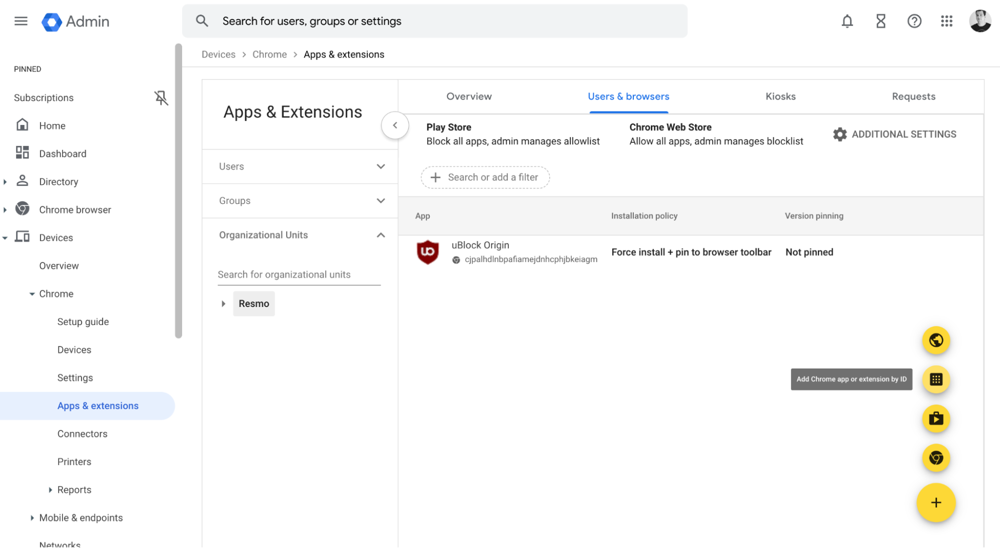

# Browser Extension Admin Guide

Once your Resmo admin triggers an email from the SaaS Directory UI, employees will receive an email from Resmo. After clicking on the link provided in the email, the extension installation process will begin. Recipients can proceed to the related page and install the extension for their browsers.&#x20;

Resmo then starts using the browser extension to capture employee SaaS logins and shows the collected data on the [Apps Dashboard](saas-discovery-apps-dashboard.md) and [Employees Dashboard](saas-discovery-employees-dashboard.md).

<table><thead><tr><th width="386">Features/Browsers</th><th width="98">Chrome</th><th width="91">Brave</th><th width="90">Firefox</th><th>Safari</th></tr></thead><tbody><tr><td>MDM Support</td><td>✔︎</td><td>✔︎</td><td>X</td><td>X</td></tr><tr><td>Accessing the history data</td><td>✔︎</td><td>✔︎</td><td>✔︎</td><td>X</td></tr><tr><td>Blocking specific domains</td><td>✔︎</td><td>✔︎</td><td>✔︎</td><td>✔︎</td></tr><tr><td>Blocking unauthorized apps</td><td>✔︎</td><td>✔︎</td><td>✔︎</td><td>✔︎</td></tr><tr><td>Capturing the logins with web requests</td><td>✔︎</td><td>✔︎</td><td>✔︎</td><td>X</td></tr><tr><td>Capturing the logins with form submissions</td><td>X</td><td>X</td><td>X</td><td>✔︎</td></tr><tr><td>Capturing the logins with SSO</td><td>✔︎</td><td>✔︎</td><td>✔︎</td><td>X</td></tr><tr><td>Showing an organization's password warning</td><td>✔︎</td><td>✔︎</td><td>✔︎</td><td>✔︎</td></tr></tbody></table>

### Syncing The Extension


* **Heartbeat**

Every 15 minutes, the extension synchronizes with the server and gets new config data.

* **Send History**

Every 24 hours, the usages of apps known to Resmo are searched within the browser history, and sent to the server.

* **Get Blocked Domains**

Every 15 minutes, the blocked domains list is checked to see whether there are any changes in the list.

* **Get Unauthorized Apps**

Every 15 minutes, the list of apps that are marked as "Unauthorized" within Resmo is checked to see whether there are any changes in the list.


There are **three statuses for the extension**, "Success" ("Protected by Resmo" text in the popup), "Failure" ("Extension is not active" text in popup), and "Idle" ("Extension is idle" text in popup).&#x20;

* If the extension is in "**Success**" or "Failure" status, the "Sync Now" button in the extension popup can be used to execute all the steps in the "Heartbeat" section. Additionally, if the extension is in "Failure" status, it will try to register itself and transition to "Success" status and start working.&#x20;
* If the extension is in "Failure" or "**Idle**" status, every 15 minutes, the extension will automatically try to register itself and try to transition to "Success" status by successfully completing the "Heartbeat" step of the "Sync" section.&#x20;
* If an error occurs, the extension will transition to "**Failure**" status, if the browser is MDM managed and the profile should not be monitored, the extension will transition to "Idle" status. In both cases, the following steps in the "Sync" section will not be executed.
* If the extension is in "Success" status, steps in the "Sync" section will be periodically executed. Restarting the browser executes related steps in the "Sync" section, depending on the status of the extension.

### Login Capture

#### **Username/Email Address & Password**

* **Tracking requests (Chrome & Firefox)**&#x20;

Requests that contain a username/email address & password are tracked and marked as a "login-related request" . If the result is not an error for such requests, login events are sent to the server.&#x20;


Passwords are never sent to the server, however, if the user desires, the hash of the password is sent to the server. This allows Resmo to identify shared password usage for each user. More info on the "Enable Reused Password Detection" section in Settings/Browser Extension.&#x20;


* **Tracking form submissions (Safari)**&#x20;

username/email address & password information are taken from the webpage once a form action button, in most cases this button is named "Login" , "Submit" , or "Continue" , is clicked. If these values are found, a login event is sent to the server.&#x20;


Passwords are never sent to the server, however, if the user desires, the hash of the password is sent to the server. This allows Resmo to identify shared password usage for each user. More info on the "Enable Reused Password Detection" section in Settings/Browser Extension.


### SSO

Logins with Google and Microsoft, in most cases, by clicking a button named "Log in with Google" or "Log in with Microsoft" are tracked and a login event is sent to the server.

### Webpage Effects

#### Password Strength Tooltip

If the "Enable Password Strength Tooltip" is selected in Settings/Browser Extension page, users will see a tooltip giving information on the present and missing fields chosen in "Password Policy" section in Settings/Browser Extension page.

#### Warn Users on Unauthorized App Usage

Depending on the value of "Warn Users on Unauthorized App Usage" in the Settings/Browser Extension page, an informative element can be seen when navigating to a webpage of an app that is marked as "Unauthorized":&#x20;

* **Disabled:** nothing is displayed
* **Warning:** A yellow banner is displayed on top of the webpage&#x20;
* **Block:** A red page is displayed, blocking the contents of the webpage

#### Block specific webpages

Access to the listed webpages in the "Domains to Block" section in the Settings/Browser Extension page will be blocked. This section allows users to block webpages that are not listed on the Apps page within Resmo.

### Installing the browser extension

#### MDM:&#x20;

Install the extension from the store and it will automatically start working for the browser profiles that use work emails.&#x20;

#### Manual:&#x20;

* **Step A:** Go to `“https://browser.resmo.com/extension?token={token}“`&#x20;
* **Step B:** Install the extension from the store.
* You can either do Step A first and then Step B, or vice versa.

Go to the SaaS Discovery configuration screen and see the Browser Extensions section. There are three options to choose from:

* **Copy your installation link:** You can use this link to copy your unique installation link and test it before sending it out to everyone.
* **Send installation link to everyone:** Clicking this button triggers an email that will send the installation link to everyone in your directory integration. By clicking the provided link in the email, recipients can proceed with the installation process.


You can add more than one browser or browser profile using your token. Once you have installed the extension, the setup process is complete.


This feature enables you to easily install the Resmo browser extension and begin monitoring your organization's SaaS activity. By adding multiple browsers or profiles, you can customize the monitoring to meet your organization's needs.

### Browser Extension MDM Installation Guide

You can install Resmo’s browser extension in your organization through several MDM (Mobile Device Management) solution to ensure seamless rollout. There are several ways to install.

#### Chrome Browser Management

1. In the Resmo go Settings and Browser Extension page, copy your organization token.
2. Navigate to the [Google Admin Console](https://admin.google.com/).
3. Sign in with your administrator account.
4. From the Devices section, select "Chrome."
5. On the Chrome management page, click on "Apps & extensions."
6. Click “Users & Browsers” tab.
7. On the right bottom of the page, click the yellow plus (+) button and select “Add Chrome app or Extension by ID”

<figure><figcaption></figcaption></figure>

8. In the form, write Resmo’s extension ID, bbccnhenkklbacbmpfbjfpellahdfedp and save.
9. You’ll see the Resmo will be added to your list.&#x20;
10. Click on the Resmo logo on the list and in the Installation policy select. “Force Install + pin to browser toolbar”
11. In the Policy for extension write your organization token in the format: `{"orgToken": {"Value": "YOUR TOKEN"}}`

<figure><figcaption></figcaption></figure>

This method is compatible with most of the MDM solutions for macOS. The following is the sample configuration. Remember to replace `REPLACE_ORG_TOKEN` with your organization token, which you can grab from Settings -> Browser Extension page. Bbccnhenkklbacbmpfbjfpellahdfedp is Resmo’s Chrome extension ID, which is hard codded.

## MDM Policy for macOS:

1. Click the Save button on the top.&#x20;
2. The extension will roll out to your users gradually and you’ll be able to collect.&#x20;

```
<?xml version="1.0" encoding="UTF-8"?>
<!DOCTYPE plist PUBLIC "-//Apple//DTD PLIST 1.0//EN" "http://www.apple.com/DTDs/PropertyList-1.0.dtd">
<plist version="1.0">
    <dict>
        <key>PayloadContent</key>
        <array>
            <dict>
                <key>PayloadContent</key>
                <dict>
                    <key>com.google.Chrome</key>
                    <dict>
                        <key>Forced</key>
                        <array>
                            <dict>
                                <key>mcx_preference_settings</key>
                                <dict>
                                    <key>ExtensionInstallForcelist</key>
                                    <array>
                                        <string>bbccnhenkklbacbmpfbjfpellahdfedp;https://clients2.google.com/service/update2/crx</string>
                                    </array>
                                </dict>
                            </dict>
                        </array>
                    </dict>
                </dict>
                <key>PayloadEnabled</key>
                <true/>
                <key>PayloadIdentifier</key>
                <string>com.resmo.chrome.bbccnhenkklbacbmpfbjfpellahdfedp</string>
                <key>PayloadType</key>
                <string>com.apple.ManagedClient.preferences</string>
                <key>PayloadUUID</key>
                <string>8A2E404C-D67E-4F93-BC04-529F939FABF8</string>
                <key>PayloadVersion</key>
                <integer>1</integer>
            </dict>
            <dict>
                <key>PayloadContent</key>
                <dict>
                    <key>com.google.Chrome.extensions.bbccnhenkklbacbmpfbjfpellahdfedp</key>
                    <dict>
                        <key>Forced</key>
                        <array>
                            <dict>
                                <key>mcx_preference_settings</key>
                                <dict>
                                    <key>orgToken</key>
                                    <string>REPLACE_ORG_TOKEN</string>
                                </dict>
                            </dict>
                        </array>
                    </dict>
                </dict>
                <key>PayloadEnabled</key>
                <true/>
                <key>PayloadIdentifier</key>
                <string>com.resmo.chrome.D658A52D-317C-4D10-A45E-D2CE72B33566</string>
                <key>PayloadType</key>
                <string>com.apple.ManagedClient.preferences</string>
                <key>PayloadUUID</key>
                <string>D658A52D-317C-4D10-A45E-D2CE72B33566</string>
                <key>PayloadVersion</key>
                <integer>1</integer>
            </dict>
        </array>
        <key>PayloadDescription</key>
        <string>Automatic enrollment for Resmo chrome extension</string>
        <key>PayloadDisplayName</key>
        <string>Resmo Chrome Extension</string>
        <key>PayloadIdentifier</key>
        <string>com.google.Chrome.extensions.bbccnhenkklbacbmpfbjfpellahdfedp</string>
        <key>PayloadOrganization</key>
        <string></string>
        <key>PayloadRemovalDisallowed</key>
        <true/>
        <key>PayloadScope</key>
        <string>System</string>
        <key>PayloadType</key>
        <string>Configuration</string>
        <key>PayloadUUID</key>
        <string>FEE7D91B-5977-4979-BD0C-E077484699F3</string>
        <key>PayloadVersion</key>
        <integer>1</integer>
    </dict>
</plist>
```

#### MDM Policy for Windows

Coming soon.
