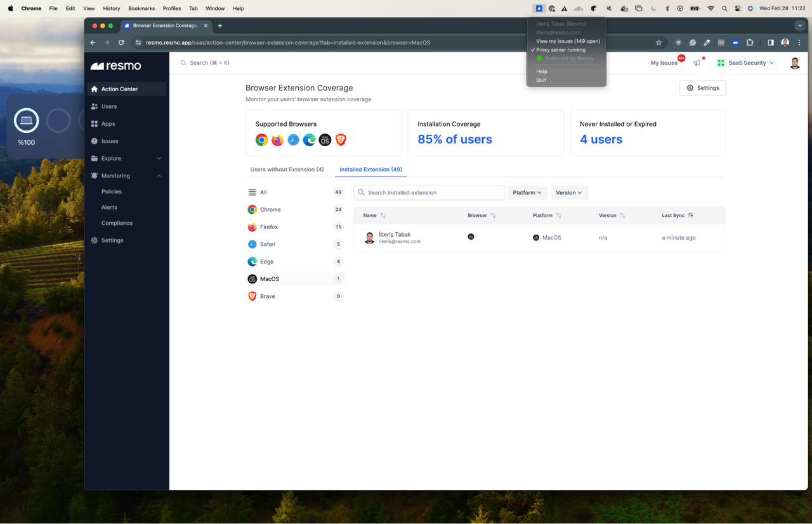

# Resmo Agent (Beta)

Resmo Agent is an on-host tool to capture employee SaaS logins. It proxies HTTPS requests using a self-signed certificate, captures login requests and informs Resmo with minimum required data.&#x20;

Strength of a captured password is decided on by the agent based on the password policy entered by the customer, password is never sent to the server.

| Features/Browsers                          | Agent |
| ------------------------------------------ | ----- |
| MDM Support                                | X     |
| Accessing the history data                 | X     |
| Blocking specific domains                  | X     |
| Blocking unauthorized apps                 | ✔︎    |
| Capturing the logins with web requests     | ✔︎    |
| Capturing the logins with form submissions | X     |
| Capturing the logins with SSO              | X     |
| Showing an organization's password warning | X     |

### Syncing The Agent

#### Heartbeat&#x20;

Every 15 minutes, the agent synchronizes with the server and gets new config data.

#### Get Unauthorized Apps&#x20;

Every 15 minutes, the list of apps that are marked as "Unauthorized" within Resmo is checked to see whether there are any changes in the list.

### Login Capture

#### **Username/Email Address & Password**

* **Tracking requests**

Requests containing a username/email address & password are tracked and marked as a "login-related request".


Passwords are never sent to the server, however, if the user desires, the hash of the password is sent to the server. This allows Resmo to identify shared password usage for each user. More info on the "Enable Reused Password Detection" section in Settings/Browser Extension.&#x20;


<figure><figcaption></figcaption></figure>

### User Notification for Unauthorized App

When a user accesses or attempts to access an unauthorized app, the agent notifies the user to inform the app's status.

<figure><figcaption></figcaption></figure>

### Known Limitations

* Available only to MacOS.
* AWS SDK fails `[SSL: CERTIFICATE_VERIFY_FAILED]` certificate verify failed: self-signed certificate in certificate chain (\_ssl.c:1006)
* SSO Logins are not captured
* No support to block specific domains

### Installation

Agent is currently in beta, thus it is only available through [support@resmo.com](mailto:support@resmo.com). Resmo support will send you an installation package based on your platform architecture and guide you through the installation.

#### Installation Package Content

<figure><figcaption></figcaption></figure>

After downloading the package, you need to run the following command to add certificate authority in Keychain Access:

```
sudo security add-trusted-cert \
  -d \
  -r trustRoot \
  -k /Library/Keychains/System.keychain \
  certs/cert.crt
```

Then you are ready to run the agent; run the following command with your information:


```
./resmo-agent --email <YOUR_COMPANY_EMAIL_ADDRESS> --api-key <YOUR_EXTENSION_TOKEN>

```

