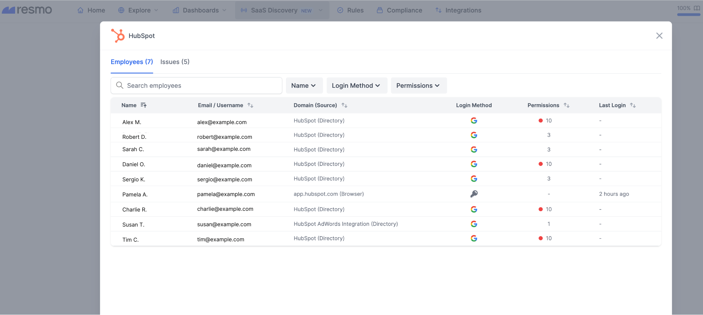
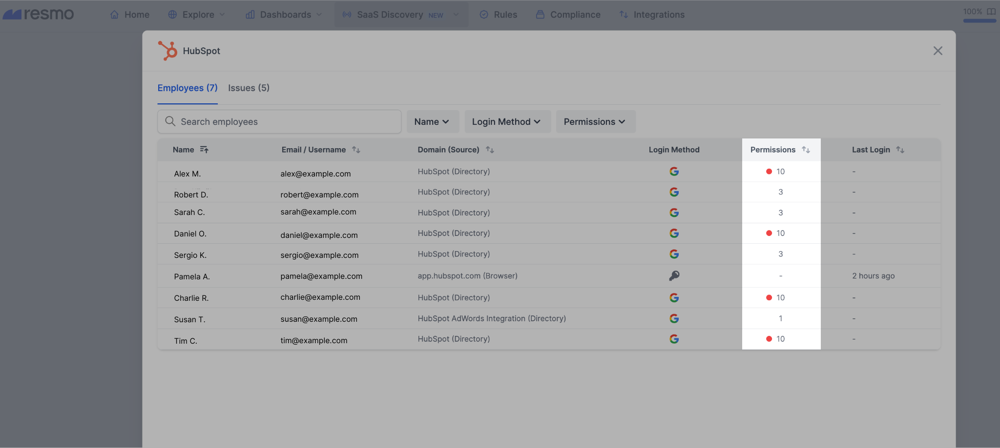
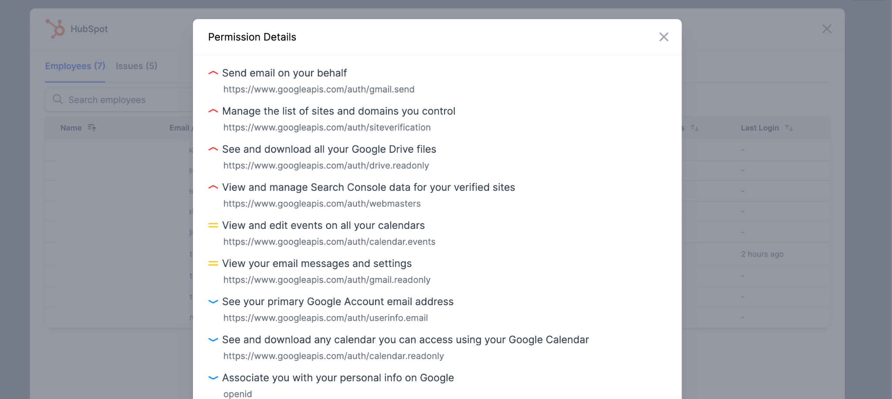

# SaaS Discovery Apps Dashboard

SaaS Discovery Apps Dashboard is where you can monitor every SaaS app used in your company in one place. From this section, you can **view all login activity for apps**. The results are compiled from both integrations (currently, only Google Workspace integration is available) and browser extensions.

Additionally, there is an **"Others" section** for unknown apps that have not yet been added to Resmo. We are continuously adding more apps to our database to help you keep track of your organization's SaaS usage.

This feature provides you with valuable insights into the activity and usage of various apps within your organization. It enables you to identify trends, track usage patterns, and make informed decisions based on real-time data.

### How it works

By clicking on any application, you can view the login details for each email account associated with it, along with any issues that may have been identified. There are several types of issues that may be detected:

**Weak Passwords:** We check to see if the password is weak or not.

**Shared Passwords:** We check to see if the password is shared with another login.

**Excessive OAuth Permissions:** We monitor the SSO login scopes for Github, Google, and Microsoft.


It is important to note that we do not send any passwords from the browser to our applications. All passwords are kept in the browser for security purposes.


This feature allows you to quickly and easily identify potential security issues with your organization's SaaS applications. By addressing these issues, you can help to improve the overall security and integrity of your systems.

## The Apps Dashboard basics

### SaaS apps overview

You can click on each SaaS app card displayed on your dashboard to see their details.&#x20;

<figure><figcaption></figcaption></figure>

This will open a detailed modal that shows employee and issue information (see the example below).

<figure><figcaption></figcaption></figure>

The table shows the following data:

* Employee info (name, email/username, domain)
* Employee last login&#x20;
* Login method
* Permissions

### Employee permissions

Click on the permission number on each row to see employee access permissions.&#x20;

<figure><figcaption></figcaption></figure>

This opens a new modal containing permission data with their severity level and permission scope.

<figure><figcaption></figcaption></figure>

### Filtering the results

Filters help you reduce the results down to what you are looking for. The Apps Dashboard has the following filters available, along with a search box:

* Tags
* Resmo integrations: Apps installed as Resmo integrations. Select true or false.
* Apps with issues
* Order dropdown menu (alphabetical, numerical)
