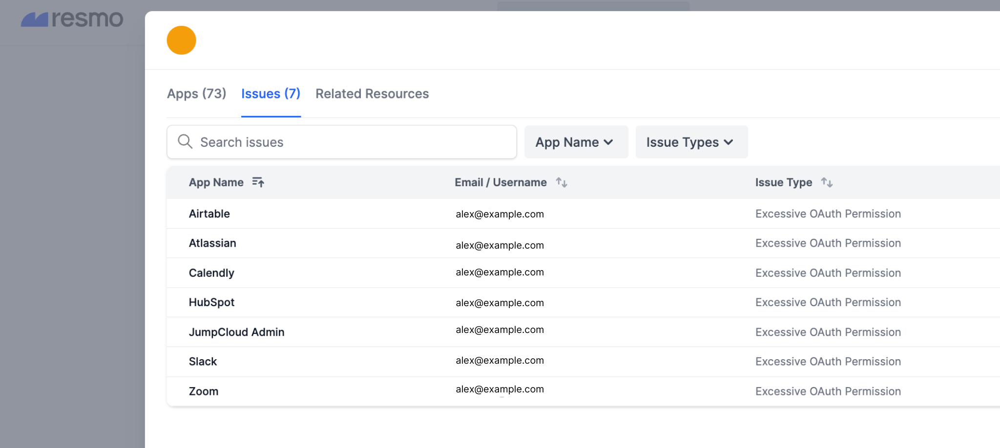

# SaaS Discovery Employees Dashboard

The SaaS Discovery dashboard is where you can monitor employee SaaS usage and security issues in one place. This page also shows employee browsers and employees without extensions.&#x20;

## Sending browser extension installation link to employees

1. Click on the Employees without Extensions number from the related card. Or click the Extensions filter and select Not Enrolled. This will list employees without the Resmo browser extension.&#x20;
2. See the Actions column and click the three dots on an employee's row. Then, send the installation link.&#x20;
3. You can send the installation link in bulk from SaaS Discovery > Apps Dashboard > Configure button on the top right of the page > select either:

* Copy Installation Link to send manually
* MDM Installation Guides (Mobile Device Management) to ensure that all employees have the browser extension installed.
* Send Installation Link to Everyone (everyone from your directory integration)
* [See browser extension installation](saas-discovery.md#installing-the-browser-extension).

## Monitoring employee SaaS usage

The Employee Dashboard provides an overview table of your employees with their emails, names, SaaS apps, browsers, and the number of security issues. You can click on each employee to see their details.

1. Click on an employee.

<figure><figcaption></figcaption></figure>

2. This will open a new modal window containing detailed SaaS usage and security information related to that employee.&#x20;

<figure><figcaption></figcaption></figure>

The information available on this modal includes:

* App name
* Domain
* Login method
* Permissions
* Last login
* Security issues
* Related resources

3. The Issues tab shows all SaaS security issues related to the selected employee, like excessive permissions and weak passwords. Click the issue type to view details.

<figure><figcaption></figcaption></figure>

4. The Related Resources displays resources related to the selected employee. ([See resources](broken-reference).)&#x20;


Resmo collects resources from Resmo integrated services only.&#x20;

