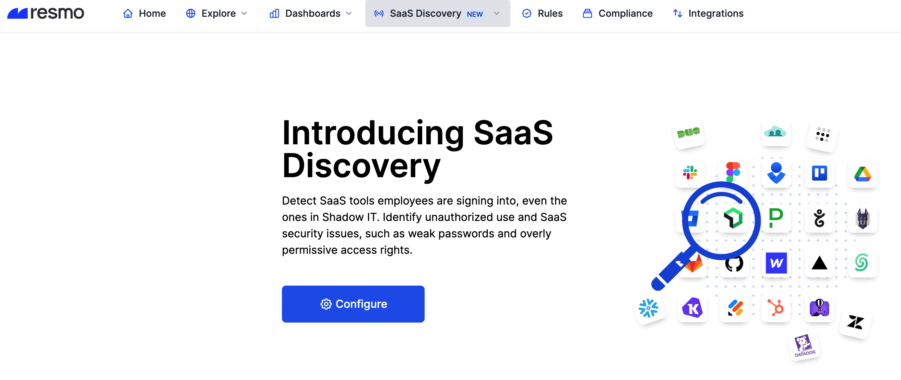
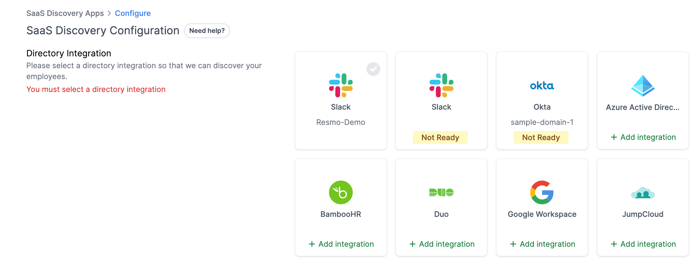
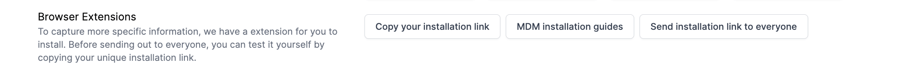
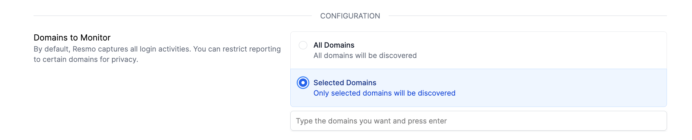
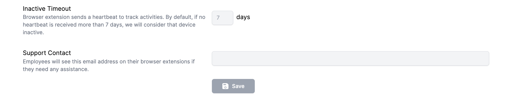

# SaaS Discovery Methods

SaaS Discovery uses Google Workspace to capture your employees' SaaS usage and/or the Resmo browser extension. Resmo SaaS Discovery feature supports Chrome and Edge browsers.

It is recommended to add Google Workspace as a directory integration as well as install the Chrome browser extension to get the best results.


At least one method must be available for SaaS Discovery to operate.




## How to configure SaaS Discovery

1. Log in to your Resmo account and click **SaaS Discovery** from the navigation bar.
2. Click the **Configure** button from the opening screen.

<figure><figcaption></figcaption></figure>

3. Select a **directory integration** to let Resmo discover your employees.

<figure><figcaption></figcaption></figure>


Here, you can add a new integration or select an already added integration. It's important to note that not all Resmo integrations are supported.&#x20;

Only the directory-supported ones can be used, as they allow you to synchronize your organization's employees and users with Resmo SaaS Discovery.



If you decide to change your integration, please exercise caution, as any employee missing in the new integration will be removed.


4. Next, download the Resmo browser extension to capture more specific data.&#x20;

<figure><figcaption></figcaption></figure>


Before inviting your employees to download the extension, you can test it yourself by copying your unique installation link.


* Click the Send Installation Link to Everyone button to deliver an email with unique installation links to your employees.

5. Select whether you want to **restrict reporting to specific domains or capture all login activities**. Resmo captures all login activities by default.

<figure><figcaption></figcaption></figure>


With this section, you can track only selected domains. For instance, you can track logins from a specific domain, such as "@resmo.com." By selecting this option, you can focus on tracking specific domains that are important for your organization. This can provide a more targeted approach to monitoring SaaS application usage within your company.


6. Next, determine how many days of **browser inactivity** will be considered as an inactive device.

<figure><figcaption></figcaption></figure>


By default, browser extensions send a heartbeat to track user activities. If a heartbeat is not received for more than 7 days, we will consider the device to be inactive. However, you can adjust the number of days for the inactive threshold by changing the configuration settings.&#x20;

This feature allows you to monitor the activity of the browser extension on each device and **identify inactive devices** that may need further attention. By adjusting the threshold, you can customize the monitoring to meet the needs of your organization.


7. Enter a **support contact email**. Employees will see this email address on their browser extensions if they need any assistance.
8. Save.&#x20;
9. Now, you can start tracking the SaaS usage in your company through the [Apps Dashboard](saas-discovery-apps-dashboard.md) and [Employees Dashboard](saas-discovery-employees-dashboard.md).

### SaaS Discovery Methods

#### Google Workspace

If your organization uses [Google Workspace](../integrations/google-workspace-integration.md), Resmo allows you to establish a connection, turning it into a Directory for your initial SaaS discovery. Resmo, upon setup, identifies employee SaaS logins based on their email accounts, whether accessed via Single Sign-On (SSO) or email login.

#### Azure Active Directory

Another efficient method to jumpstart your SaaS discovery is by integrating your [Azure Active Directory](../integrations/azure-active-directory-integration.md) with Resmo. This integration enables Resmo to initiate the discovery process through Azure AD, capturing relevant SaaS logins seamlessly.

You can find and complete the directory integrations in just a few minutes through your Get Started page on Resmo.

#### Browser Extension

Resmo's browser extension enhances the depth and accuracy of SaaS login and activity tracking. Each user within your organization installs this extension on their browser, empowering your IT team to identify suspicious activities in real-time. Furthermore, the extension provides immediate warnings to users and suggests authorized alternatives when encountering unknown applications.

[Visit the browser installation guide for details](chrome-browser-extension.md).

#### Integrations

In addition to these methods, Resmo offers over 100 native integrations with popular SaaS applications. These integrations simplify the detection of app-to-app connections and enhance security monitoring throughout your organization's SaaS ecosystem. [See Integrations guide](../integrations/integrations-guide.md).
