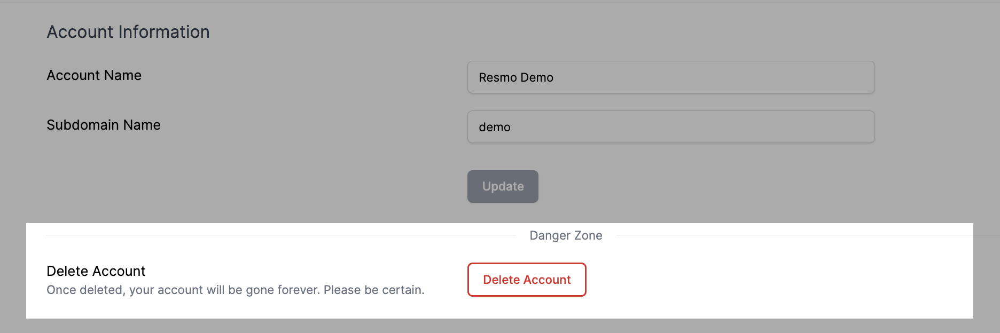
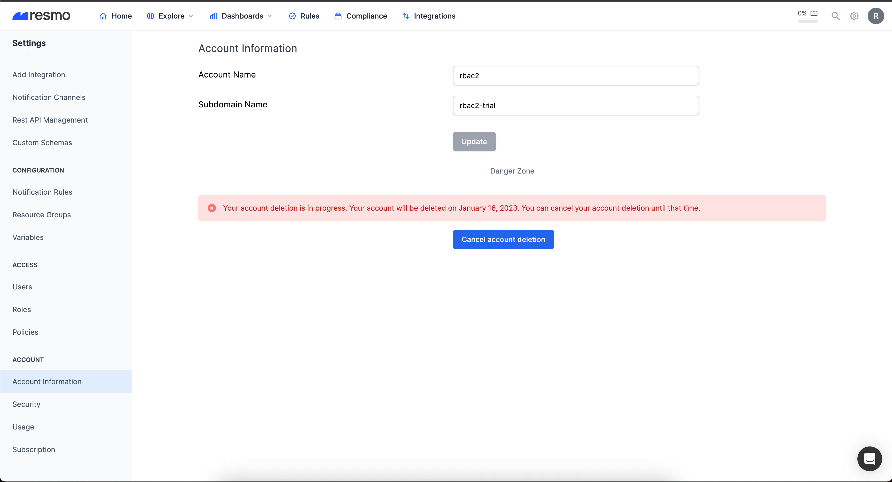

# Accounts

Once a user registers to Resmo, an account is automatically created. Users can have access to multiple accounts.&#x20;

### How to open your Account Information page

The Account Information page shows your account name and subdomain name.&#x20;

1. Log in to your Resmo account.
2. Then, go to your Settings page by clicking the gear icon from the upper right corner.
3. See the Account section from the left side panel.

### Account deletion

The owner user of an account can delete it from Setting>Account Information>Delete Account. The account will be automatically deleted a week after the deletion request.

<figure><figcaption></figcaption></figure>

#### **Canceling an account deletion request**

Deletion requests can be canceled within the week after you submit the request. To cancel it, go to Settings>Account Information and click the Cancel Account Deletion button.

<figure><figcaption></figcaption></figure>

### Membership deletion

A user with membership deletion permission can delete membership from Settings>Users>User Detail> Delete. Resmo deletes all related information, such as API keys belonging to that user.&#x20;


The remaining resources are transferred to the owner user.


### Troubleshooting

If you have any questions or issues regarding your Resmo account, contact us via live chat or email us at contact@resmo.com.
