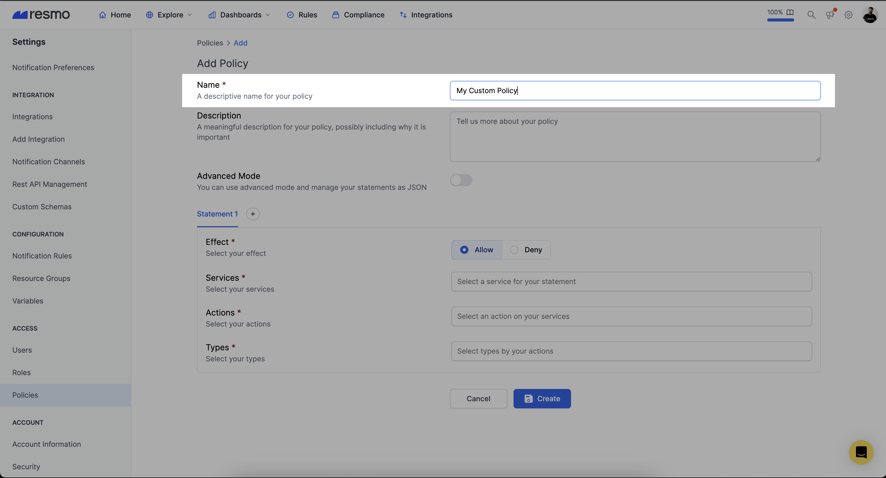
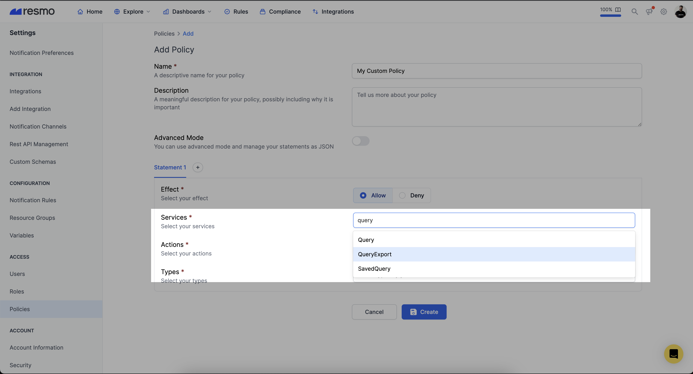
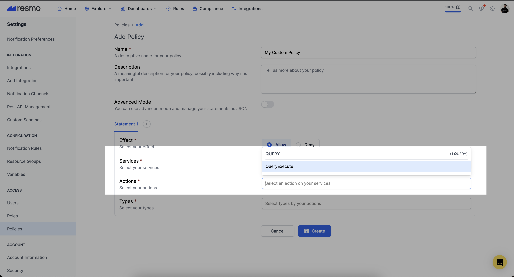
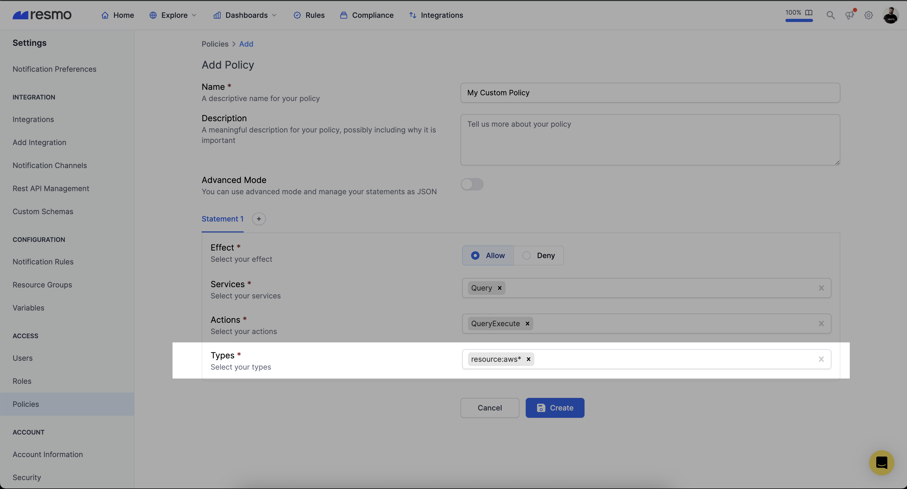
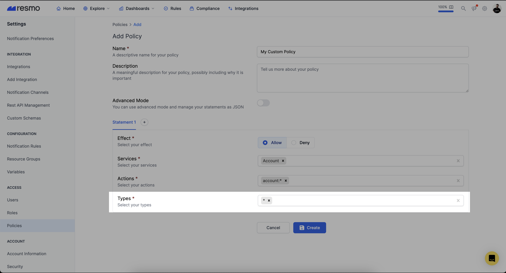
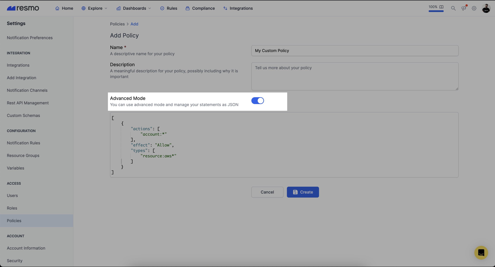
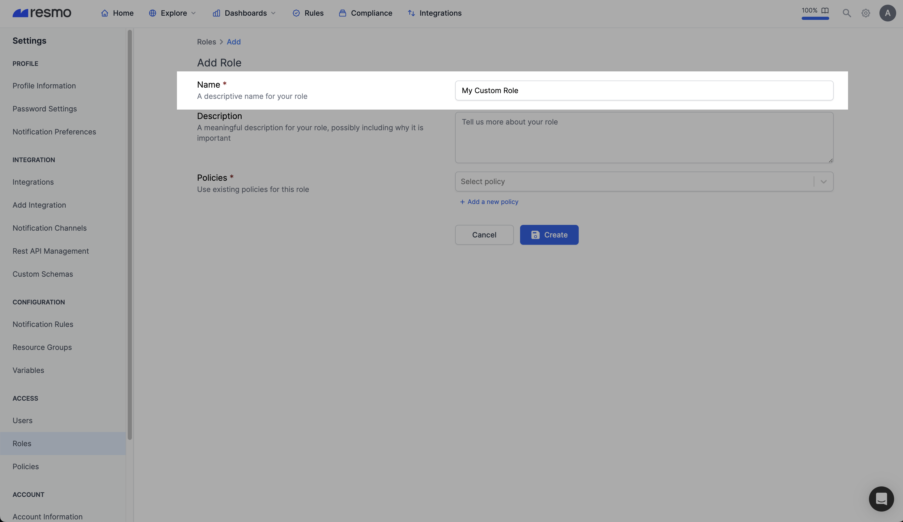
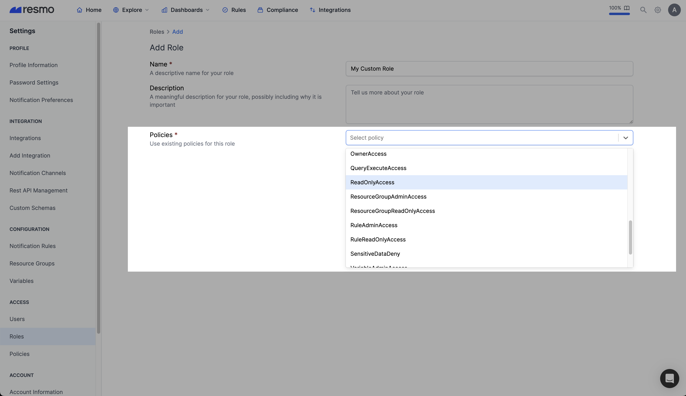

# Custom Roles and Policies

## Policies

You manage access in Resmo by creating policies and attaching them to Roles. A policy is a group of access/deny statements that, when associated with a role, defines their permissions. Permissions in the policies determine whether the request is allowed or denied.

### Statements

A statement is a container for permissions. A policy may contain up to 10 statements. You can define allow or deny statements inside the same policy. A statement consists of the following elements:

* **Actions:** An action is an identifier for the method of the service.&#x20;
* **Effect**: Use `Allow` or `Deny` to indicate whether the policy allows or denies access.
* **Types:** Some actions may require a type to restrict access granularly. It can be one or more than one of the following types:
  * **Resource:** It indicates whether the policy allows or denies specified resource types. This type starts with resource: prefix.&#x20;
  * **Integration:** It indicates whether the policy allows or denies specified integration types. This type starts with integration: prefix.&#x20;
  * **Notification Channel:** It indicates whether the policy allows or denies specified notification channel types. This type starts with channel: prefix.

### Examples of policy syntax <a href="#policies-syntax-examples" id="policies-syntax-examples"></a>

The following policy allows access to AWS resources for query execution.


```json
[
  {
    "actions": [
      "query:execute"
    ],
    "effect": "Allow",
    "types": [
      "resource:aws*"
    ]
  }
]
```


The following policy denies access to some of the sensitive resources for all actions.

```json
[
  {
    "actions": [
      "*"
    ],
    "effect": "Deny",
    "types": [
      "resource:bamboohr_company_file",
      "resource:bamboohr_employee",
      "resource:bamboohr_user",
      "resource:brex_company",
      "resource:brex_user",
      "resource:cloudflare_user",
      "resource:device"
    ]
  }
]
```

### How to create a custom policy

You can create custom roles and policies with the enterprise plan, but accessing these features can be requested.

#### How to create a custom policy using a policy builder

1. Log in to your Resmo account.
2. Click **Settings** from the navigation bar and then, **Policies**.
3.  Give a name to your custom policy.\


    <figure><figcaption></figcaption></figure>
4. Select Allow or Deny from the **Effect** section.
5.  Select one or more services from the **Services** dropdown. This selection will fill the actions dropdown.\


    <figure><figcaption></figcaption></figure>
6.  Select one or more actions from the **Actions** dropdown. \


    <figure><figcaption></figcaption></figure>
7. You need to select allowed/denied types from the **Types** dropdown If you select type-dependent action. If you select an action without type dependency, you must give `*` or `*:*` as type.&#x20;
   1.  An action with type dependency\


       <figure><figcaption></figcaption></figure>
   2.  An action without type dependency\


       <figure><figcaption></figcaption></figure>
8. Click the Create button.

#### How to create a custom policy from JSON

1. Log in to your Resmo account.
2. Click Settings from the navigation bar and then, Policies.
3. Give a name to your custom policy.
4.  Open Advanced Mode.\


    <figure><figcaption></figcaption></figure>
5. Create your statements with JSON syntax. You can take a look at JSON policy JSON syntax from [here](custom-roles-and-policies.md#policies-syntax-examples). Take a look at all services and actions from [here](https://docs.resmo.com/i/roles-and-policies/service-and-actions).
6. Click the Create button.

## Roles

A role is a container for the policies. A role may contain up to 10 policies. You can use roles to delegate access to users. You can group custom or managed policies to define user access levels.

### Examples of role syntax

The following role gives the user read-only access to the not restricted resources inside the sensitive-data-deny policy.

```json
{
  "policies": [
    "readonly-access",
    "sensitive-data-deny"
  ]
}
```

### How to create a custom role&#x20;

You can create custom roles and policies with the enterprise plan, but accessing these features can be requested.

1. Log in to your Resmo account.
2. Click Settings from the navigation bar and then Roles.
3.  Give a name to your custom policy.\


    <figure><figcaption></figcaption></figure>
4.  Select one or more policies from the **Policies** dropdown. You can select max 10 policies for a role.\


    <figure><figcaption></figcaption></figure>
5. Click the Create button.

### Support

Contact our team via live chat or email us at contact@resmo.com for further queries and support requests regarding Roles and Policies.
