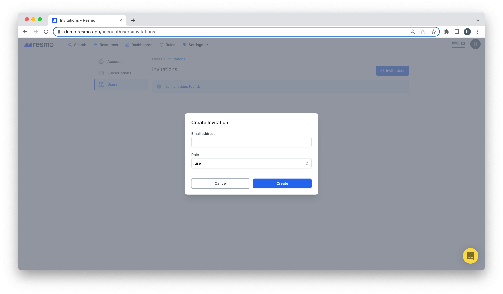

# User

Users are the individuals that have access to your Resmo account. There are three user roles on Resmo; user, admin, and owner. See [User Roles](user-roles.md) for a detailed definition and limitations of each.

### How to see user details

1. Log in to your Resmo account.
2. Navigate to Account>Users. You will see a list of all users in your account.
3. Click on an individual user to see user details. The user detail page is where you can change a user's role.

### How to send a user invitation&#x20;

1. Navigate to Users from your Resmo Account page.
2. Hit the Invitations button at the top right corner. This page shows current invitations.&#x20;

3\. Click the Invite User button to invite a user to your account.

4\. Type the user's email address and select a user role to assign.

5\. Then, Create.

### Support

If you have any queries or issues concerning users, please get in touch with us via live chat on our website or email us at contact@resmo.com.
