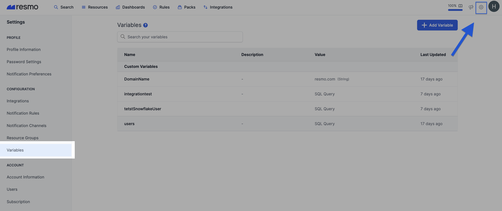
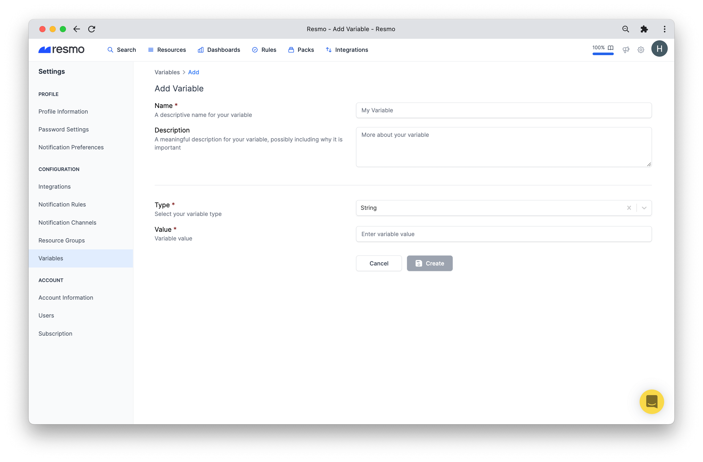
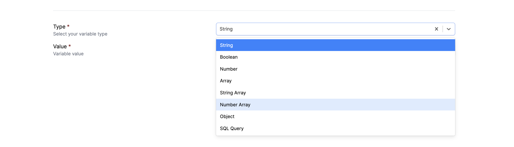
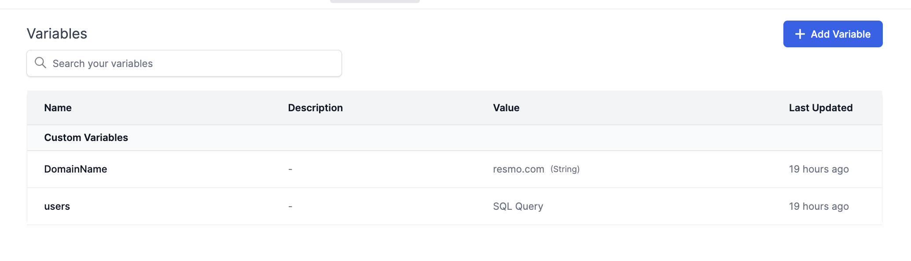
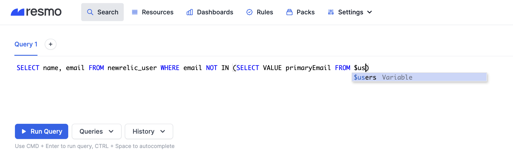

# Variables

A variable is a value that stores information to be referenced. In Resmo, variables enable you to define static or dynamic constructs to be used in your SQL queries.&#x20;

Some use cases in Resmo required writing longer queries manually or spending more time on forming queries unique to your business each time you need. Now, variables provide a solution by allowing you to write reusable queries faster.

### How do $variables work?

Once you define a variable with the correct type and value, it will be suggested in autocomplete when you are typing a query. For example, after defining a user variable, you can type $user to refer to that construct in your queries.&#x20;

#### Available variable types

* String
* Boolean
* Number
* Array
* String Array
* Number Array
* Object
* SQL Query

### What do $variables offer to Resmo users?

Variables reduce the time spent typing queries with values unique to your business. They allow you to create reusable constructs and retrieve data faster.&#x20;

Some common values that are better suited for variables rather than literal values include:

* User list
  * ie. list of users in your company as a static array or refer to Google Workspace or Okta users as your directory to check against any unwanted user registration in any of your tools.
* Domain names
* Email list
* Numbers
  * ie. data retention
* Long re-used SQL queries
* Other long values such as long URLs

### How to add a new $variable

1. Log in to your Resmo account and navigate to **Settings>Variables**.



2\. Click the **Add Variable** button from the top right.

.png>)

3\. Give a **descriptive name** to it, one that you will remember when typing your SQL query.



4\. Next, select a **variable type** such as string, boolean, or number.



5\. Finally, enter a **variable value** in the related field.

6\. Hit the **create** button, and now your variable is all set. You can find your created variables on the Variables page.&#x20;



7\. To see if it's properly working, go to the Search page and type a query that includes the variable.&#x20;



### Variable examples

* **See GitHub admin users who are not on your Gsuite users list:**

$users = `SELECT VALUE primaryEmail FROM gsuite_user`

```
SELECT * FROM github_org_member WHERE role = 'admin' and user.email NOT IN $users['email']
```

* **Check if Cloudflare proxies your domain/s:**

$DomainName = `yourdomain.com`

```
SELECT * FROM cloudflare_zone_dnsrecord WHERE zone_name = $DomainName and proxied
```

* **Search for AWS EC2 instances in predefined regions:**

$allowedRegion = \[“us-west2”,”us-east-1”]

`SELECT * FROM aws_ec2_instance WHERE region IN $allowedRegion`

### Support

For any questions or issues concerning variables, feel free to contact us via live chat or email us at contact@resmo.com.
